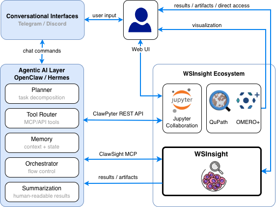

#  WSInsight: Cloud-Native Single-Cell Pathology Inference on Whole Slide Images

WSInsight is a whole-slide pathology toolkit for giga-pixel H&E images. It started as a fork of WSInfer and has since grown into an end-to-end pipeline that covers tissue segmentation, patch/object inference (region- and cell-level), and downstream spatial analytics — all driven by a single CLI and reproducible across laptops, workstations, and cloud clusters. Outputs are first-class artifacts for QuPath, GeoJSON-aware viewers, OMERO+, and notebooks.

> [!IMPORTANT]
> WSInsight is a research tool. It is not cleared for clinical workflows or patient-facing decisions.


## Highlights

- **Two model families.** WSInfer-compatible region/patch classifiers from the WSInfer Model Zoo *and* WSInsight-native cell-level Vision Transformers (CellViT-256, CellViT-SAM-H, CellViT-Virchow, HoverNet-PanNuke) for single-cell detection and classification.
- **End-to-end CLI.** `wsinsight run` chains tissue segmentation → patch extraction → inference → downstream analytics in one resumable command; every stage is also available as a standalone subcommand (`patch`, `infer`, `reg`, `hplot`, `ncomp`, `ecomp`, `tcomp`, `niche`, `agg`, `export`).
- **Spatial analytics.** Built-in neighborhood / edge / triad composition (`ncomp` / `ecomp` / `tcomp`) on Delaunay cell graphs, H-Plot layer-wise composition curves (which can plot a cell type **or a discovered niche** across tissue layers), unsupervised niche discovery + profiling (`niche` / `niche-profile`), and density-gated cell-type aggregate detection (`agg`, e.g. T+B cells → tertiary lymphoid structures).
- **QuPath integration.** A companion extension ([`qupath-extension-wsinsight`](https://github.com/huangch/qupath-extension-wsinsight)) drives every CLI subcommand from a generated form, so adding a CLI option propagates to the GUI without Java changes.
- **Transparent URIs.** Read WSIs from local disks, S3 buckets, or GDC manifests and write outputs to local paths or S3 using the same flags. GeoJSON / OME-CSV exports interoperate with QuPath, OMERO, and standard pathology viewers.
- **Reproducible runs.** Per-run metadata capture, deterministic configuration, container-friendly execution, and an idempotent `patch → infer` split for caching expensive stages.

## Visual Overview

 Original H&E                                 | Heatmap of Tumor Probability
:--------------------------------------------:|:----------------------------------------------------------------------:
  | 

 Heatmap of Dead Cell Probability                       | Heatmap of Connective Cell Probability
:------------------------------------------------------:|:-----------------------------------------------------------------:
  | 

## Documentation

- [Latest user and API guides](https://wsinsight.readthedocs.io)
- [Change history and issue reporting](https://github.com/huangch/wsinsight)

## Quick Start

### WSInfer-compatible workflow

1. Prepare a directory of whole slide images, for example the sample data under `tests/reference`.
2. Choose a registered model name from `wsinfer-zoo ls` or provide a custom configuration.
3. Run inference (one-shot workflow that performs patch extraction + inference):

   ```bash
   wsinsight run \
     --wsi-dir slides/ \
     --results-dir results/ \
     --model breast-tumor-resnet34.tcga-brca \
     --batch-size 32 \
     --num-workers 4
   ```

4. Inspect outputs in `results/model-outputs-*`, open the GeoJSON artifacts in QuPath or your preferred viewer, and review `run_metadata_*.json` for the captured environment details.

Prefer an explicit two-step flow? Run `wsinsight patch` to generate cached patches/HDF5 metadata (idempotent and resumable), then invoke `wsinsight infer` against the same `--results-dir` to produce CSV/GeoJSON/OME-CSV outputs. Both commands expose the identical URI, segmentation, and QuPath options as `wsinsight run`.

### WSInsight-native workflow (CellViT models)

WSInsight adds cell-centric Vision Transformer and HoverNet variants that are not part of upstream WSInfer. To run them:

1. Stage your WSIs as before and ensure the conda environment includes the CellViT dependencies (installed automatically via the instructions above).
2. Pick one of the WSInsight-native model identifiers (see list below) from the registry.
3. Launch inference, for example with `CellViT-SAM-H-x40`:

   ```bash
   wsinsight run \
     --wsi-dir slides/ \
     --results-dir results-cellvit/ \
     --model CellViT-SAM-H-x40 \
     --batch-size 16 \
     --num-workers 8
   ```

4. Review the outputs in `results-cellvit/model-outputs-*` and downstream GeoJSON artifacts just like the compatible workflow.

Available WSInsight model names:

- `CellViT-256-x20`
- `CellViT-256-x40`
- `CellViT-256-x40-AMP`
- `CellViT-SAM-H-x20`
- `CellViT-SAM-H-x40`
- `CellViT-SAM-H-x40-AMP`
- `CellViT-Virchow-x40-AMP`
- `hovernet_fast_pannuke`

> [!TIP]
> Use `CUDA_VISIBLE_DEVICES=… wsinsight run …` to pin execution to specific GPUs. The command prints an environment summary before inference begins.

## Installation

WSInsight supports both a fully reproducible conda workflow and lighter manual installs if you already manage your own environment.

### Option A: Reproducible conda setup (recommended)

Run the following commands from the repository root to recreate the tested environment. Adjust the environment name if you need to keep multiple copies side-by-side. The steps below are also captured in [`conda-setup.sh`](conda-setup.sh) for convenience.

```bash
# reset any previous environment
source /opt/anaconda3/etc/profile.d/conda.sh   # adapt if conda lives elsewhere
conda deactivate || true
conda env remove -n wsinsight -y || true

# create a clean env with Python 3.11 + GDAL 3.11.3
conda create -n wsinsight python=3.11 gdal=3.11.3 "setuptools<67" -c conda-forge -y
conda activate wsinsight
python -m pip install --upgrade pip

# pin numpy < 2 across every install step via constraints.txt
python -m pip install -c constraints.txt "numpy<2"

# install heavy ML stacks first so CUDA dependencies settle early
python -m pip install -c constraints.txt \
  torch torchvision torch-geometric tensorflow keras stardist nvidia-ml-py

# HistomicsTK wheels are hosted externally; keep numpy pinned for ABI safety
python -m pip install \
  --trusted-host github.com \
  --trusted-host raw.githubusercontent.com \
  --trusted-host girder.github.io \
  --find-links https://girder.github.io/large_image_wheels \
  -c constraints.txt "numpy<2" pyvips histomicstk

# pre-install remaining heavy deps to reduce pip resolver backtracking
python -m pip install -c constraints.txt "numpy<2" \
  scikit-learn shapely geopandas pyproj rasterio pyogrio \
  openslide-python wsidicom paquo "wsinfer-zoo>=0.6.2" \
  igraph leidenalg s3fs boto3 platformdirs timm \
  tiffslide imagecodecs opencv-python-headless orjson click

# install WSInsight itself in editable mode (--no-build-isolation speeds up resolve)
python -m pip install -c constraints.txt --no-build-isolation -e .

# safety check: ensure numpy stayed below 2.0 (stardist requires it)
python -c "import numpy; v=numpy.__version__; assert int(v.split('.')[0]) < 2, f'numpy {v} >= 2.0; re-run: pip install -c constraints.txt \"numpy<2\"'"
```

Optionally, run a smoke test to ensure the CLI starts with representative environment variables:

```bash
S3_STORAGE_OPTIONS='{"profile":"saml"}' \
WSINSIGHT_ZOO_REGISTRY_PATH='/workspace/wsinsight/wsinsight/zoo/wsinsight-zoo-registry.json' \
WSINSIGHT_REMOTE_CACHE_DIR='/tmp' \
KERAS_HOME='/workspace/wsinsight/wsinsight/keras' \
wsinsight --help
```

> [!TIP]
> Every `python -m pip install …` line honors `constraints.txt`, keeping the dependency graph deterministic even as upstream wheels evolve.

### Option C: Docker (no local installation required)

A prebuilt GPU-enabled image is published to Docker Hub.  It includes all
dependencies (conda, GDAL, PyTorch, TensorFlow, WSInsight) so **no local
installation is needed** beyond Docker and the
[NVIDIA Container Toolkit](https://docs.nvidia.com/datacenter/cloud-native/container-toolkit/latest/install-guide.html).

```bash
# Pull the published image
docker pull huangchtw/wsinsight:latest
```

The repository ships two helper scripts:

 Script                                         | Purpose
------------------------------------------------|----------------------------------------------------------------------------------------------------------------------------------------------------------------------------
 [`docker-run.sh`](docker-run.sh)               | Pull + run: mounts a data directory as `/workspace`. Supports interactive shell and direct-command modes. Usage: `bash docker-run.sh /path/to/data [GPU_ID] [COMMAND ...]`
 [`docker-build-push.sh`](docker-build-push.sh) | Build the image from source and push to Docker Hub (maintainers).

Quick example — interactive shell:

```bash
# All GPUs, mount current directory
bash docker-run.sh $(pwd)

# Specific GPU
bash docker-run.sh $(pwd) 2
```

Quick example — direct command (no interactive shell):

```bash
# All GPUs — pass "" as GPU_ID, then the wsinsight command
bash docker-run.sh $(pwd) "" wsinsight run \
  --wsi-dir /workspace/slides --results-dir /workspace/results \
  --model breast-tumor-resnet34.tcga-brca --batch-size 32

# Pin to GPU 2
bash docker-run.sh $(pwd) 2 wsinsight run \
  --wsi-dir /workspace/slides --results-dir /workspace/results \
  --model breast-tumor-resnet34.tcga-brca --batch-size 32
```

Inside the container the conda `wsinsight` environment is pre-activated.  When
no command is given after the GPU argument you land in an interactive shell;
when a command is provided it runs and the container exits.

#### First-run model auto-download (no manual setup)

Model weights are **not** baked into the image. The first time a registered
model name is requested, WSInsight transparently downloads the corresponding
TorchScript weights from Hugging Face Hub (using `huggingface_hub` with the
`hf_transfer` accelerator) via the registry entry's `hf_repo_id`/`hf_revision`
fields. No login or user input is needed for the public WSInsight model
repositories.

The cache lives at `/app/hf-cache` inside the container. `docker-run.sh`
mounts a named Docker volume (`wsinsight-hf-cache`) on that path so the
downloaded weights persist across container restarts — subsequent invocations
reuse the cache and skip re-downloading. To inspect or remove the cache:

```bash
docker volume inspect wsinsight-hf-cache
docker volume rm     wsinsight-hf-cache      # force a fresh download next run
```

If you invoke `docker run` directly (without `docker-run.sh`), add
`-v wsinsight-hf-cache:/app/hf-cache` to keep the same behaviour.

Alternatively, run a one-shot command without an interactive shell:

```bash
docker run --rm -it \
  --gpus all --shm-size=32g \
  --user $(id -u):$(id -g) \
  -v /path/to/slides:/slides \
  -v /path/to/results:/results \
  -v wsinsight-hf-cache:/app/hf-cache \
  huangchtw/wsinsight:latest \
  bash -lc 'wsinsight run --wsi-dir /slides --results-dir /results --model breast-tumor-resnet34.tcga-brca'
```

> [!TIP]
> `--shm-size=32g` is recommended for multi-worker dataloaders.  The image bakes in `WSINSIGHT_ZOO_REGISTRY_PATH`, `KERAS_HOME`, and `HF_HOME=/app/hf-cache` so no environment setup is needed.

### Option B: Manual installation

1. **Install deep learning backends**

- Follow the [official PyTorch installation guide](https://pytorch.org/get-started/locally/) for your OS / CUDA stack.
- (Optional) Bring in TensorFlow/Keras if you plan to convert models or run StarDist.
- Verify CUDA visibility with `python -c 'import torch; print(torch.cuda.is_available())'` and confirm your driver matches the [CUDA compatibility matrix](https://docs.nvidia.com/deploy/cuda-compatibility/).

1. **Install WSInsight**

- Stable PyPI: `python -m pip install wsinsight`
- Latest main: `python -m pip install git+https://github.com/huangch/wsinsight.git`
- Conda-Forge: `conda install -c conda-forge wsinsight` (use `mamba install` for faster solving)

1. **Install from source (development)**

```bash
git clone https://github.com/huangch/wsinsight.git
cd wsinsight
python -m pip install --editable .
pre-commit install
```

The editable install enables rapid iteration on CLI commands, model definitions, and docs. `pre-commit` keeps formatting/lint guards active during `git commit`.

## CLI Overview

Stable commands are available by default.  Experimental commands (`hplot`,
`hplot-finalize`, `niche`, `niche-profile`, `ecomp`, `tcomp`, `agg`, `import`) are hidden unless the
environment variable `WSINSIGHT_EXPERIMENTAL=1` is set; see
[Experimental Features](#experimental-features) below.

 Command            | Purpose
--------------------|------------------------------------------------------------------------------------------------------------------------------------------------------------------------------------------------------------------------------------------------------------------------------------------------------------------------------------------------------------------------------------
 `wsinsight run`    | Segment tissue, extract patches, execute model inference, and optionally run ncomp analytics and export (one-shot orchestration of `patch` → `infer` → `ncomp` → `export`). Pass `--ncomp` to enable neighborhood composition and `--export-geojson` / `--export-omecsv` to write GeoJSON / OME-CSV files at the end of the run.  Pass `--agg` (with `--agg-name` / `--agg-types`) to run density-gated aggregate detection as part of the same command. Experimental analytics (`--hplot`, `--niche`) require `WSINSIGHT_EXPERIMENTAL=1`.
 `wsinsight patch`  | Perform tissue segmentation, cache/crop patches to HDF5, and prepare metadata for later inference runs. By default, slides with existing patch outputs are skipped; pass `--overwrite` to regenerate.
 `wsinsight infer`  | Load cached patches, run the selected model, and produce per-cell CSV outputs. By default, slides with existing CSV outputs are skipped; pass `--overwrite` to regenerate. Enrich object CSVs with region-level probabilities via `--region-inference-dir`. Use the standalone `ncomp`/`export` commands (or `run`) for downstream analytics. Does **not** run analytics or export — use `run` for one-shot orchestration.
 `wsinsight reg`    | Post-hoc object-to-region registration: enrich existing object-level CSV outputs with `region_prob_*` columns derived from a separate region-level inference run (`-r`). Equivalent to running `infer` with `--region-inference-dir`, but works on already-completed runs without re-running inference. Use `--overwrite` to replace existing `region_*` columns.
 `wsinsight ncomp`  | Neighborhood composition analysis on existing cell-detection outputs. For each target cell, builds a Delaunay graph, collects k-hop neighbors, and records the cell-type composition of the local neighborhood. Outputs per-cell CSVs under `ncomp-outputs-csv/`.
 `wsinsight niche-profile` | Summarise each discovered niche by its dominant cell types, writing `niche-profile-composition.csv` under the results directory. Reads the per-cell labels produced by `niche`. Whole-slide H&E cohorts have no transcriptome, so no marker-gene table is produced. Experimental (`WSINSIGHT_EXPERIMENTAL=1`).
 `wsinsight export` | Merge all available per-cell analytics (inference, ncomp, and — when enabled — H-plot / niche) into `export-csv/` and write GeoJSON and/or OME-CSV files. Can be run any time after inference without repeating the full pipeline.
 `wsinsight tosbu`  | Convert patch-prediction CSVs into the `.txt` / `.json` formats used by the Stony Brook Biomedical Informatics viewers. Takes `RESULTS_DIR` and `OUTPUT` as positional arguments plus `--wsi-dir`, `--execution-id` and `--study-id`; `--make-color-text` additionally emits per-patch colour files (slow — tune with `--num-processes`).
 `wsinsight import` | **Experimental** (`WSINSIGHT_EXPERIMENTAL=1`). Import spatial-transcriptomics expression onto WSInsight cells: map each transcriptomics cell onto the registered H&E via the ST2WSI transform, match it to the nearest `model-outputs-csv` detection, and write one AnnData `.h5ad` per slide under `imported-xenium/` (never modifies `model-outputs-csv/`). Supports `--platform xenium` (raw Xenium directories) and `--platform xenium-h5ad` (annotated `.h5ad` inputs). Each matched detection's `model-outputs-csv` columns are carried onto the cell under a `model_` prefix (plus `model_cell_id`); optional per-cell sidecars added with `--include niche,hplot,ncomp` are merged under their own `niche_`/`hplot_`/`ncomp_` prefixes (`model` is always imported). Reads a `sptx-list://` manifest via `-s`/`--sptx-dir`; format is `path<TAB>sample_id<TAB>transform_dir` (columns 2 and 3 optional). For `xenium-h5ad`, column 3 should point to each sample's transform folder containing `registration_params.json`. Supports `--transform affine\|affine+bspline\|none`, `--genes`, `--include`, `--match-max-dist`, and `--dry-run` (report the cell↔detection hit-rate only, writing nothing).

Pick `run` when you want a one-liner for single slides or small batches; switch
to the explicit `patch` → `infer` → `ncomp` → `export` flow to resume large
jobs, share patch caches across model variants, or parallelize stages on
separate machines. `run` is the only command that orchestrates all stages —
`infer` focuses solely on model inference. Use the standalone `wsinsight ncomp`
command to (re-)run neighborhood analytics on existing inference outputs
without repeating inference. All commands share global options such as
`--log-level`. Use `wsinsight <command> --help` for the full option list,
including QuPath integration flags and segmentation controls.

## AI agents (MCP)

WSInsight ships an optional [Model Context Protocol](https://modelcontextprotocol.io/)
server that exposes the same CLI surface to MCP-aware clients
(Claude Desktop, the VS Code Copilot MCP integration, custom agents).
Install with `pip install 'wsinsight[mcp]'` and run `wsinsight-mcp`
(stdio by default; `--http 127.0.0.1:8765` for Streamable HTTP).
Each stable subcommand becomes an MCP tool whose input schema mirrors
its CLI parameters; long-running tools (`run`, `patch`, `infer`, `ncomp`)
return a `job_id` and are polled via `job_status` / `job_logs` /
`cancel_job`. See [`wsinsight/mcp/README.md`](wsinsight/mcp/README.md)
for client config snippets, the full tool list, and concurrency / GPU
pinning details.

### Human-in-the-loop agentic architecture

The MCP server is the entry point for a larger human-in-the-loop stack
that lets people drive WSInsight in natural language while keeping a human
in control of every result.



- **Conversational interfaces** — users issue chat commands from Telegram
  or Discord, or interact directly through the Web UI.
- **Agentic AI layer (OpenClaw / Hermes)** — a planner decomposes the task,
  a tool router calls MCP/API tools, memory holds context and state, an
  orchestrator manages flow control, and a summarization step returns
  human-readable results.
- **[ClawSight](https://github.com/huangch/clawsight)** bridges the agent
  layer to WSInsight over MCP, while **ClawPyter** exposes a REST API for
  Jupyter collaboration.
- **WSInsight ecosystem** — the WSInsight engine produces results and
  artifacts that flow back to the user and into QuPath, OMERO+, and Jupyter
  for visualization and review, so a human validates the analysis at each
  step.

## Results Layout

```text
<results-dir>/
├── masks/
│   └── <slide>.jpg                 Tissue segmentation masks (produced by patch / run)
├── patches/
│   └── <slide>.h5                  HDF5 patch files (produced by patch / run)
├── model-outputs-csv/
│   └── <slide>.csv                 Per-patch/cell inference results
├── model-outputs-geojson/
│   └── <slide>.geojson             GeoJSON from reg --export-geojson (region-registered)
├── model-outputs-omecsv/
│   └── <slide>.ome.csv.gz          OME-CSV from reg --omecsv (region-registered)
├── imported-xenium/
│   └── <sample_id>.h5ad            Spatial-transcriptomics expression mapped onto cells (wsinsight import)
├── hplot-outputs-csv/
│   ├── hplots/<slide>.csv          Per-layer H-plot curve (one row per layer)
│   └── cells/<slide>.csv           Per-cell data with spatial annotations
├── hplot-outputs.csv               Aggregated H-plot curve (all slides)
├── ncomp-outputs-csv/
│   └── <slide>.csv                 Per-cell (node-level) composition
├── ecomp-outputs-csv/
│   └── <slide>.csv                 Per-edge composition
├── tcomp-outputs-csv/
│   └── <slide>.csv                 Per-triad composition + geometry
├── niche-outputs-csv/
│   ├── cells/<slide>.csv           Per-cell niche labels + features
│   └── niches/<slide>.csv            Annotation-level merged niche regions
├── niche-outputs-geojson/                (with --export-geojson)
│   ├── cells/<slide>.geojson        GeoJSON cell detections with niche labels
│   └── niches/<slide>.geojson         GeoJSON niche region annotations
├── graphs/
│   └── <slide>.h5                  Cached Delaunay triangulation (shared by hplot/ncomp/niche)
├── export-csv/
│   └── <slide>.csv                 Merged per-cell CSV (inference + hplot + ncomp + niche)
├── export-geojson/
│   └── <slide>.geojson             GeoJSON export (wsinsight export --geojson)
├── export-omecsv/
│   └── <slide>.ome.csv.gz          OME-CSV export (wsinsight export --omecsv)
└── <command>_metadata_*.json       Per-command run log — every subcommand (run,
                                    patch, infer, export, reg, ncomp, ecomp,
                                    tcomp, hplot, hplot-finalize, niche,
                                    niche-profile, agg, import) writes one with the
                                    same {command, params, runtime, timestamp}
                                    schema; patch/infer also record the model.
```

## Output File Formats

### `patches/<slide>.h5`

Cached patch coordinates (and optionally images) produced by `patch` or `run`. One HDF5 file per slide.

 Dataset / Attribute                        | Shape / Type       | Description
--------------------------------------------|--------------------|-----------------------------------------------------------------------
 `/coords`                                  | (N, 2) int32       | Top-left patch coordinates (x, y) at level 0
 `/coords` → `patch_size` (attr)            | int32              | Side length of each patch in pixels
 `/coords` → `patch_level` (attr)           | int32              | WSI magnification level (always 0)
 `/coords` → `patch_spacing_um_px` (attr)   | float64            | Microns-per-pixel used for coordinate calculation
 `/coords` → `tile_dim` (attr, optional)    | int32[2]           | Tiling dimensions `[width, height]` for end-to-end models
 `/images` (optional)                       | (N, H, W, 3) uint8 | RGB patch images (when `--cache-image-patches` is used)
 `/polygons/coords` (optional)              | (K, 2) float32     | Tissue polygon vertices (ragged array)
 `/polygons/offsets` (optional)             | (M+1,) int64       | Ragged array offsets: polygon *i* = `coords[offsets[i]:offsets[i+1]]`
 `/slide` → `slide_path` (attr, optional)   | utf-8 string       | Original WSI file path
 `/slide` → `slide_mpp` (attr, optional)    | float64            | Microns-per-pixel of the WSI
 `/slide` → `slide_width` (attr, optional)  | float64            | WSI width in pixels
 `/slide` → `slide_height` (attr, optional) | float64            | WSI height in pixels

### `model-outputs-csv/<slide>.csv`

Produced by `infer`, `run`, and `reg`.

 Column                                                        | Notes
---------------------------------------------------------------|-------------------------------------------------------------------------
 `minx`, `miny`                                                | Top-left corner of the patch/detection bounding box (pixels)
 `width`, `height`                                             | Bounding box size (pixels)
 `prob_<class>`                                                | Model probability for each class (e.g. `prob_tumor`, `prob_lymphocyte`)
 `qupath_detection_parent`                                     | Parent annotation name — only with `--qupath-measurement-detection-dir`
 `region_minx`, `region_miny`, `region_width`, `region_height` | Matched region bounding box — only with `--region-inference-dir`
 `region_prob_<class>`                                         | Region-level class probabilities — only with `--region-inference-dir`

### `hplot-outputs-csv/hplots/<slide>.csv`

Per-layer H-plot curve produced by `hplot` or `run --hplot`.

 Column              | Description
---------------------|--------------------------------------------------------------------------------------
 `layer`             | Integer layer index; 0 = base-region boundary, negative = inside, positive = outside
 `target_type_prop`  | Proportion of target cells at this layer
 `target_type_count` | Count of target cells
 `base_type_prop`    | Proportion of base cells
 `base_type_count`   | Count of base cells
 `all_type_count`    | Total cell count
 `distance`          | Cumulative µm distance from the border

### `hplot-outputs-csv/cells/<slide>.csv`

Per-cell file: the original `model-outputs-csv/<slide>.csv` extended with spatial columns.

 Column                            | Description
-----------------------------------|----------------------------------------------------------------------------------------------------------------
 `minx`, `miny`, `width`, `height` | Inherited from inference output
 `prob_<class>`                    | Inherited from inference output
 `center_x`, `center_y`            | Cell centre in pixels
 `is_base_type`                    | `True` if the cell's predicted class is a base type
 `is_target_type`                  | `True` if the cell's predicted class is a target type
 `signed_distance_to_border`       | Hop distance to the base-region boundary; negative = inside, 0 = border, positive = outside, NaN = unreachable

### `hplot-outputs.csv`

Cohort-level H-plot curve aggregated across all slides. Produced by `hplot`, `run --hplot`, or `hplot-finalize`.

Columns: `id`, `layer`, `target_prop`, `target_count`, `base_prop`, `base_count`, `all_count`, `distance`

### `ncomp-outputs-csv/<slide>.csv`

Per-cell neighborhood composition produced by `ncomp` or `run --ncomp`.

 Column                       | Description
------------------------------|-------------------------------------------------------------------
 `center_x`, `center_y`       | Cell centre in pixels
 `cell_type`                  | Predicted cell type (argmax of `prob_*` columns)
 `neighborhood_size`          | Number of k-hop graph neighbors (excluding self)
 `neighborhood_<class>_count` | Count of neighbors of each class; one column per model class
 `neighborhood_<class>_prop`  | Proportion of neighbors of each class; one column per model class

### `niche-outputs-csv/cells/<slide>.csv`

Per-cell niche labels and features produced by `niche` or `run --niche`.

 Column                               | Description
--------------------------------------|----------------------------------------------------------------
 All columns from `model-outputs-csv` | Inherited inference + region columns
 `niche_cluster`                        | Integer cluster label assigned by KMeans (or Leiden-derived k)
 `feature_normalized_*`               | Normalized DGI embedding features (one column per dimension)
 `feature_raw_*`                      | Raw DGI embedding features (one column per dimension)

### `niche-outputs-csv/niches/<slide>.csv`

Annotation-level merged niche regions produced by `niche` or `run --niche`. Adjacent cells sharing the same `niche_cluster` are dissolved into contiguous polygonal regions.

### `graphs/<slide>.h5`

Cached Delaunay triangulation shared by `hplot`, `ncomp`, and `niche`. Created on the first run and reused on subsequent runs to skip the expensive `scipy.spatial.Delaunay` computation. The cache stores **unpruned** edges; each command applies its own distance threshold at load time.

The file is automatically invalidated and rebuilt when the underlying `model-outputs-csv/<slide>.csv` changes (detected via cell count and a SHA-256 hash of cell centres).

HDF5 layout:

 Dataset / Attribute   | Shape / Type | Description
-----------------------|--------------|-----------------------------------------------------------------
 `num_cells` (attr)    | int64        | Row count — fast staleness check
 `mpp` (attr)          | float64      | Microns-per-pixel used for cell centre computation
 `centers_hash` (attr) | bytes        | SHA-256 of `cell_centers` bytes — bulletproof staleness check
 `cell_centers`        | (N, 2) int32 | Cell centres (`center_x`, `center_y`), row-aligned with the CSV
 `simplices`           | (M, 3) int32 | Raw Delaunay triangles (3 vertex indices each)
 `edges_source`        | (E,) int32   | Unique undirected edges — source vertex
 `edges_target`        | (E,) int32   | Unique undirected edges — target vertex
 `edges_length`        | (E,) float64 | Euclidean edge length in pixels

### `export-csv/<slide>.csv`

Merged per-cell CSV produced by `build_export_csvs()` (called programmatically via `wsinsight.export_helpers`). Left-joins `model-outputs-csv`, `hplot-outputs-csv/cells`, `ncomp-outputs-csv`, and `niche-outputs-csv/cells` on shared geometry keys.

 Column                                                    | Description
-----------------------------------------------------------|-------------------------------------------
 All columns from `model-outputs-csv/<slide>.csv`          | Inherited inference + region columns
 `center_x`, `center_y`                                    | Cell centre (added if absent)
 `is_base_type`, `is_target_type`                          | From H-plot cells output (when available)
 `signed_distance_to_border`                               | From H-plot cells output (when available)
 `cell_type`, `neighborhood_size`                          | From ncomp output (when available)
 `neighborhood_<class>_count`, `neighborhood_<class>_prop` | From ncomp output (when available)
 `niche_*`                                                   | From niche cell output (when available)
 `feature_normalized_*`, `feature_raw_*`                   | From niche cell output (when available)

## Key Parameters

### Neighborhood Composition (`--ncomp-*` options in `run` and `wsinsight ncomp`)

 Option                          | Default | Description
---------------------------------|---------|--------------------------------------
 `--max-neighbor-distance` | `25.0`  | Maximum Delaunay edge length in µm
 `--k`                     | `2`     | k-hop neighborhood radius
 `--overwrite`                   | off     | Recompute existing per-slide outputs

### Model Selection

 Option                 | Applies to              | Description
------------------------|-------------------------|-------------------------------------------------------------------------------------------------------------------------------------------------------------------------------------------------
 `-m / --model`         | `run`, `patch`, `infer` | Name of a registered model from the WSInsight / WSInfer Model Zoo. Mutually exclusive with `--config`, `--model-path`, and `--zoo-model-dir`.
 `-c / --config`        | `run`, `patch`, `infer` | Path to a custom JSON model configuration file (see `wsinsight/schemas/model-config.schema.json`). Must be paired with `--model-path`. Mutually exclusive with `--model` and `--zoo-model-dir`.
 `-p / --model-path`    | `run`, `patch`, `infer` | Path to the custom TorchScript weights. Required when `--config` is used. Mutually exclusive with `--model` and `--zoo-model-dir`.
 `-z / --zoo-model-dir` | `run`, `patch`, `infer` | Path to a folder containing `config.json` and `torchscript_model.pt`. Shorthand for `--config` + `--model-path`. Mutually exclusive with `--model`, `--config`, and `--model-path`.

### Inference Performance

 Option               | Default | Applies to     | Description
----------------------|---------|----------------|----------------------------------------------------------------------------------------------------
 `-b / --batch-size`  | `32`    | `run`, `infer` | Batch size for model inference. Increase for multi-GPU setups.
 `-n / --num-workers` | auto    | `run`, `infer` | Dataloader workers feeding patches to PyTorch. Default heuristic: `min(2 × GPU count, CPU count)`.
 `--export-workers`   | auto    | `run`, `infer`, `export` | Worker processes for GeoJSON/OME-CSV export. Default reserves headroom for inference.
 `--export-object-type` | `detection` | `run`, `export` | Object type written to GeoJSON / OME-CSV (`detection` or `annotation`).
 `--stitch-workers`   | auto    | `run`, `infer`  | Thread pool size for TileFuse object-based detection stitching. Default: `min(8, CPU // 2)`.

## Example Workflows

### Run inference + ncomp + export in a single command

```bash
wsinsight run \
  --wsi-dir slides/ \
  --results-dir results/ \
  --model pancancer-lymphocytes-inceptionv4.tcga \
  --batch-size 32 \
  --ncomp \
  --export-geojson \
  --export-omecsv
```

### Running on a multi-GPU cluster with tmux

For large cohorts on a multi-GPU node, split your slide list into per-GPU shards and run
them in parallel inside a tmux session. Each pane pins one GPU via
`CUDA_VISIBLE_DEVICES` and processes its own shard of slides.

**1. Split slides into shards** (one file per GPU):

```bash
# Example: 8 GPUs → 8 shard files
split -n l/8 --numeric-suffixes=0 --additional-suffix=.txt \
  slides_all.txt datasets/slides_part_
```

**2. Launch a tmux session with one pane per GPU:**

```bash
#!/bin/bash
tmux new-session -d -s wsinsight

# Create a 4×2 grid (4 rows, 2 columns = 8 panes)
tmux split-window -v -t wsinsight:0.0
tmux split-window -v -t wsinsight:0.1
tmux split-window -v -t wsinsight:0.2
tmux select-layout -t wsinsight:0 even-vertical
tmux split-window -h -t wsinsight:0.0
tmux split-window -h -t wsinsight:0.4
tmux split-window -h -t wsinsight:0.6

# Layout:
# [pane 0 | pane 1]   GPU 0 / GPU 4
# [pane 2 | pane 3]   GPU 1 / GPU 5
# [pane 4 | pane 5]   GPU 2 / GPU 6
# [pane 6 | pane 7]   GPU 3 / GPU 7

ZOO=/path/to/zoo-model
OUT=results/
BATCH=20

for i in 0 1 2 3 4 5 6 7; do
    part=$(printf "%02d" "$i")
    tmux send-keys -t wsinsight:0.$i \
        "CUDA_VISIBLE_DEVICES=$i wsinsight run -b $BATCH -i datasets/slides_part_${part}.txt -z $ZOO -o $OUT" Enter
done

tmux attach -t wsinsight
```

All panes share the same `--results-dir`, so outputs merge automatically.

See `tmux-multi-gpu.sh` in the repository root for a ready-to-use script.

> [!TIP]
> Adapt the number of panes and GPU assignments to your hardware. For 4 GPUs, use a 2×2
> grid; for 2 GPUs, a simple horizontal split suffices.

### Run neighborhood composition on existing inference outputs

```bash
wsinsight ncomp \
  --wsi-dir slides/ \
  --results-dir results/ \
  --k 2
```

### Export merged analytics to GeoJSON / OME-CSV

```bash
wsinsight export \
  --results-dir results/ \
  --geojson \
  --omecsv \
  --export-workers 8
```

### Enrich object CSVs with region probabilities post-hoc

```bash
wsinsight reg \
  --results-dir results-cellvit/ \
  --region-inference-dir results-region/ \
  --overwrite
```

## Experimental Features

The commands and flags below are **research features under active development**.
Their CLI flags, output directory layouts, and column schemas may change without
notice in future releases.  They are hidden from `wsinsight --help` and refuse
to run unless you opt in with:

```bash
export WSINSIGHT_EXPERIMENTAL=1
```

`wsinsight describe` always emits the full schema so downstream tools (the
QuPath extension, etc.) can discover every command; only invocation is gated.

### Experimental commands

 Command                    | Purpose
----------------------------|------------------------------------------------------------------------------------------------------------------------------------------------------------------------------------------------------------------
 `wsinsight hplot`          | Standalone H-plot analysis on existing inference outputs. Requires cell-type-aware model outputs and both `--base-types` and `--target-types`. Computes layer-wise cell-type proportions from tumour boundary outward. Outputs under `hplot-outputs-csv/`.
 `wsinsight hplot-finalize` | Aggregate per-slide H-plot intermediates into a single `hplot-outputs.csv`. Use after running parallel `hplot` jobs that share the same `--results-dir`.
 `wsinsight ecomp`          | Edge-level composition analysis. For each Delaunay edge, builds the line graph, collects k-hop edge neighbors, and records the composition of edge types in the local neighborhood. Outputs per-edge CSVs under `ecomp-outputs-csv/`.
 `wsinsight tcomp`          | Triad-level composition analysis. For each Delaunay triangle, builds the dual graph (triads sharing ≥1 vertex), collects k-hop triad neighbors, and records the composition of triad types plus per-triad geometry (area, perimeter, regularity). Outputs per-triad CSVs under `tcomp-outputs-csv/`.
 `wsinsight niche`            | Niche analysis across a cohort of slides. Builds per-slide Delaunay cell graphs, trains a global Deep Graph Infomax (DGI) encoder, clusters the resulting embeddings, and writes per-cell niche labels plus annotation-level region merges under `niche-outputs-csv/`. Pass `--export-geojson` to also write GeoJSON files under `niche-outputs-geojson/`. Cross-slide analysis — cannot be parallelized across GPU shards.
 `wsinsight agg`            | Cell-type aggregate analysis on existing inference outputs. Detects connected, density-gated aggregates of a chosen cell-type set (`--types`, e.g. `t_cell,b_cell` → TLS) over the cached Delaunay graph, contracts them into a quotient graph, and writes namespaced outputs under the product label `--name`: an `object_<name>_prob_<name>` per-cell membership column (upserted into `model-outputs-csv/`), a per-aggregate sidecar under `agg-<name>-outputs-csv/`, and an `agg/<name>/` subgroup in `graphs/<slide>.h5`. The name is selectable in `hplot` via `--base-by aggregate` / `--target-by aggregate`.

Experimental stages can also be invoked inline from `wsinsight run` via
`--hplot` / `--niche` (when `WSINSIGHT_EXPERIMENTAL=1`).  `ecomp` / `tcomp` / `agg` are
standalone only.

### Simplicial composition hierarchy — `ncomp` / `ecomp` / `tcomp`

WSInsight's three composition commands form a symmetric simplicial hierarchy
on the Delaunay triangulation (`ncomp` is stable; `ecomp` / `tcomp` are
experimental):

 Command  | Simplex       | Unit                      | Adjacency     | Graph        | Output dir
----------|---------------|---------------------------|---------------|--------------|----------------------
 `ncomp`  | 0-simplex (n) | cell                      | Delaunay edge | primal       | `ncomp-outputs-csv/`
 `ecomp`  | 1-simplex (e) | Delaunay edge             | shared vertex | line graph   | `ecomp-outputs-csv/`
 `tcomp`  | 2-simplex (t) | Delaunay triad (triangle) | shared vertex | dual graph   | `tcomp-outputs-csv/`

All three share the same Delaunay cache (`graphs/<slide>.h5`), the same 25 µm
default edge filter, and the same 2-hop default neighborhood radius.  Only
`tcomp` emits per-triad geometry (area µm², perimeter µm, regularity ∈ [0, 1]
where 1.0 is equilateral).  Edges and triads are **not** merged into
`export-csv/` (different primary keys).

### H-Plot parameters (`--hplot-*` options in `run` and `wsinsight hplot`)

 Option                                  | Default  | Description
-----------------------------------------|----------|-------------------------------------------------------------------------------
 `--base-types`                    | required | Comma-separated base cell types that define the tumour cluster (e.g. `tumor`)
 `--target-types`                  | required | Comma-separated target cell types to track across layers (e.g. `lymphocyte`)
 `--base-by`   | `celltype` | Interpret `--base-types` as `celltype`, `niche`, or `aggregate` names
 `--target-by` | `celltype` | Interpret `--target-types` as `celltype`, `niche`, or `aggregate` names
 `--max-neighbor-distance`         | `25.0`   | Maximum Delaunay edge length in µm
 `--k`                             | `2`      | k-hop neighborhood radius for region detection
 `--n`                             | `8`      | Minimum neighborhood size for base-region membership
 `--r`                             | `0.5`    | Minimum base-type fraction for base-region membership
 `--range-min`                     | `None`   | Innermost layer index (≤ 0) to include in metrics
 `--range-max`                     | `None`   | Outermost layer index (≥ 1) to include in metrics
 `--samples-with-valid-range-only` | off      | Exclude slides that do not fully cover `[range-min, range-max]`
 `--overwrite`                           | off      | Recompute existing per-slide outputs

### Edge Composition parameters (`--ecomp-*` options)

 Option             | Default | Description
--------------------|---------|--------------------------------------
 `--max-edge` | `25.0`  | Maximum Delaunay edge length in µm
 `--k`        | `2`     | k-hop neighborhood radius (line graph)
 `--no-neighborhood` | off | Skip k-hop aggregation; one row per edge, no `neighborhood_*` columns (much faster)
 `--overwrite`      | off     | Recompute existing per-slide outputs

### Triad Composition parameters (`--tcomp-*` options)

 Option             | Default | Description
--------------------|---------|-------------------------------------------------------------------------
 `--max-edge` | `25.0`  | Longest-edge threshold (µm); triads with any edge above this are pruned
 `--k`        | `2`     | k-hop neighborhood radius (dual graph)
 `--no-neighborhood` | off | Skip k-hop aggregation; one row per triad, no `neighborhood_*` columns (much faster)
 `--overwrite`      | off     | Recompute existing per-slide outputs

### niche parameters (`--niche-*` options in `run` and `wsinsight niche`)

 Option             | Default | Description
--------------------|---------|------------------------------------------------------------------------------------
 `--hoptimus`   | off     | Enable H-Optimus tissue morphology features (requires GPU + timm)
 `--hoptimus-only` | off  | Use only H-Optimus features for niche and skip k-hop composition features (requires `--hoptimus`)
 `--hoptimus-pca-dim` | raw (unset) | Optional PCA dimensionality for H-Optimus embeddings; if omitted, raw H-Optimus features are used (no PCA)
 `--clusters`   | auto    | Number of KMeans clusters; when omitted, determined via Leiden community detection
 `--leiden-res` | `0.5,1.0,2.0` | Comma-separated Leiden resolutions to sweep when `--clusters` is omitted
 `--embed-dim`  | `32`    | Dimensionality of the DGI cell embedding (8–256)
 `--epochs`     | `300`   | Upper bound on DGI encoder training epochs. Early stopping is always active, so training may finish sooner
 `--patience`   | `20`    | Early-stopping patience: stop after this many consecutive epochs without a mean-loss improvement > `--min-delta`
 `--min-delta`  | `1e-4`  | Minimum relative mean-loss improvement required to reset the early-stopping patience counter
 `--min-epochs` | `50`    | Never trigger early stopping before this many epochs have elapsed
 `--amp`        | off     | Enable CUDA automatic mixed precision for DGI training (faster, lower GPU memory; no effect on CPU/MPS)
 `--seed`       | `0`     | Random seed for the niche pipeline (DGI training, Leiden sweep, KMeans), for reproducible niche ids
 `--export-geojson` | off     | Export niche results to GeoJSON files under `niche-outputs-geojson/`
 `--overwrite`      | off     | Delete cached checkpoints and recompute from scratch

### Aggregate parameters (`--agg-*` options in `wsinsight agg`)

 Option                          | Default  | Description
---------------------------------|----------|---------------------------------------------------------------------------------
 `--name`                    | required | Product label (lower-case `[a-z0-9_]+`, e.g. `tls`); namespaces every artifact and is selectable in `hplot` via `--base-by aggregate` / `--target-by aggregate`
 `--types`                   | required | Comma-separated ingredient cell types that may join the aggregate (e.g. `t_cell,b_cell`)
 `--max-neighbor-distance`   | `25.0`   | Maximum Delaunay edge length in µm
 `--k`                       | `2`      | k-hop neighborhood radius for the density gate
 `--n`                       | `8`      | Minimum neighborhood size for region membership
 `--r`                       | `0.5`    | Minimum ingredient-type fraction for region membership
 `--min-size`                | `10`     | Drop aggregates with fewer than this many cells
 `--overwrite`                   | off      | Recompute existing per-slide outputs for this name

`agg` writes three namespaced artifacts: an `object_<name>_prob_<name>`
membership column upserted into `model-outputs-csv/<slide>.csv` (siblings
preserved, so multiple `--name` runs coexist), a per-aggregate sidecar
under `agg-<name>-outputs-csv/<slide>.csv`, and an `agg/<name>/` quotient-graph
subgroup inside `graphs/<slide>.h5`.

### Experimental example workflows

Run inference + all experimental analytics + export in a single command:

```bash
export WSINSIGHT_EXPERIMENTAL=1

wsinsight run \
  --wsi-dir slides/ \
  --results-dir results/ \
  --model pancancer-lymphocytes-inceptionv4.tcga \
  --batch-size 32 \
  --hplot \
  --hplot-base-types tumor \
  --hplot-target-types lymphocyte \
  --hplot-range-min -5 \
  --hplot-range-max 5 \
  --ncomp \
  --niche \
  --export-geojson \
  --export-omecsv
```

Run niche analysis on existing inference outputs:

```bash
wsinsight niche --wsi-dir slides/ --results-dir results/
```

Run H-plot on existing inference outputs:

```bash
wsinsight hplot \
  --wsi-dir slides/ --results-dir results/ \
  --base-types tumor --target-types lymphocyte \
  --range-min -5 --range-max 5
```

Detect T+B-cell aggregates (e.g. TLS) on existing inference outputs, then plot
their member-cell fraction across tumour layers:

```bash
wsinsight agg \
  --wsi-dir slides/ --results-dir results/ \
  --name tls --types t_cell,b_cell

wsinsight hplot \
  --wsi-dir slides/ --results-dir results/ \
  --base-types tumor --target-types tls \
  --target-by aggregate \
  --range-min -5 --range-max 5
```

After parallel `hplot` jobs, aggregate to cohort level:

```bash
wsinsight hplot-finalize --results-dir results/
```

## Models and Configurations

- Models registered in the WSInfer Zoo can be listed with `wsinfer-zoo ls`.
- Bring-your-own models by supplying `--config` (JSON schema documented in `wsinsight/schemas/model-config.schema.json`) together with `--model-path` (TorchScript weights).
- Use `--zoo-model-dir` / `-z` to point at a folder that already contains `config.json` and `torchscript_model.pt`. This is a shorthand for `--config` + `--model-path` and is mutually exclusive with `--model`, `--config`, and `--model-path`.
- QuPath-generated detections and annotations can be used to create pseudo-model runs via the `--qupath-*` options in `wsinsight run`.

## Environment Variables

WSInsight reads the following environment variables at startup. Set them in your shell profile, conda activation script, or container environment so they apply to every command automatically.

 Variable                     | Purpose                                                                                                                                                                             | Example
------------------------------|-------------------------------------------------------------------------------------------------------------------------------------------------------------------------------------|---------------------------------------------------------------------------------------------
 `WSINSIGHT_ZOO_REGISTRY_PATH` | Path to a local `wsinsight-zoo-registry.json` file. **Required in air-gapped / restricted-SSL environments.** When set (and the file exists), no network call to HuggingFace is made. The legacy name `WSINFER_ZOO_REGISTRY_PATH` is still honored for one release (emits a `DeprecationWarning`). | `export WSINSIGHT_ZOO_REGISTRY_PATH=/workspace/wsinsight/devel/zoo/wsinsight-zoo-registry.json`
 `WSINSIGHT_EXPERIMENTAL`     | Set to `1` (or `true`/`yes`/`on`) to unhide experimental subcommands (`hplot`, `hplot-finalize`, `niche`, `niche-profile`, `ecomp`, `tcomp`, `agg`, `import`) and the `--hplot` / `--niche` flags on `wsinsight run`. Without it, experimental commands are hidden from `--help` and refuse to run.  See [Experimental Features](#experimental-features). | `export WSINSIGHT_EXPERIMENTAL=1`
 `S3_STORAGE_OPTIONS`         | JSON object passed verbatim to `s3fs` / `fsspec` (e.g. AWS profile, endpoint URL). Required to read/write S3 URIs.                                                                  | `export S3_STORAGE_OPTIONS='{"profile":"saml"}'`
 `GS_STORAGE_OPTIONS`         | JSON object passed verbatim to `gcsfs` / `fsspec` for Google Cloud Storage (`gs://`) URIs. Optional: auth defaults to Application Default Credentials (`GOOGLE_APPLICATION_CREDENTIALS`); set this only to override (e.g. a service-account key).                         | `export GS_STORAGE_OPTIONS='{"token":"/path/to/service-account.json"}'`
 `WSINSIGHT_REMOTE_CACHE_DIR` | Local directory where remote assets (S3 tiles, GDC downloads) are materialised. Defaults to `~/.cache/wsinsight`. Point it at a fast SSD for large cohorts.                         | `export WSINSIGHT_REMOTE_CACHE_DIR=/scratch/wsinsight-cache`
 `WSINSIGHT_WSI_BACKEND`      | Force the whole-slide-image reader. Accepts `openslide` or `tiffslide`. Default: `openslide` when its bindings are importable (preferred for richer Aperio metadata), otherwise `tiffslide`. When neither backend can read MPP, WSInsight falls back to Aperio `AppMag` and assumes vendor-typical µm/px (40× → 0.25, 20× → 0.50, 10× → 1.00, 4× → 2.50) — a warning is logged so you can verify the slide's true resolution. | `export WSINSIGHT_WSI_BACKEND=openslide`
 `KERAS_HOME`                 | Override the Keras configuration/weights directory, useful when the default home directory is on a slow or quota-limited filesystem.                                                | `export KERAS_HOME=/workspace/wsinsight/keras`

> [!TIP]
> If the CLI hangs or prints SSL errors on startup, you are almost certainly in an environment where `huggingface.co` is blocked.  Set `WSINSIGHT_ZOO_REGISTRY_PATH` to the local registry file and the issue will disappear.

## Remote and Large-Scale Data

- S3 URIs are supported out of the box; configure credentials via `S3_STORAGE_OPTIONS`.
- Google Cloud Storage URIs (`gs://bucket/prefix`) are supported the same way via `gcsfs`; auth uses Application Default Credentials by default (`GOOGLE_APPLICATION_CREDENTIALS`) and can be overridden with `GS_STORAGE_OPTIONS`.
- `--wsi-dir` can point to local folders, `s3://bucket/prefix` or `gs://bucket/prefix` locations, `gdc-manifest:///path/to/manifest.tsv`, or an `image-list:///path/to/filelist.txt` URI that references a text file listing one slide path per line (blank lines and `#` comments are ignored). If you pass a plain local text file, `wsinsight` now errors with a clear "use `image-list://`" message instead of silently coercing it. `--results-dir`, GeoJSON, and OME-CSV outputs can be written to local disks, S3 buckets, or GCS buckets with the same URI syntax.
- Every CLI that accepts `--wsi-dir`, `--results-dir`, `--region-inference-dir`, or QuPath directories uses the same URI resolver as `wsinsight patch`/`infer`. Local paths require `exists=True`, while remote paths honor the `S3_STORAGE_OPTIONS` / `GS_STORAGE_OPTIONS` credentials without checking for pre-existence—making it safe to point `--results-dir` at a brand-new bucket/key.
- `WSINSIGHT_REMOTE_CACHE_DIR` determines where remote assets are materialized locally (default: `~/.cache/wsinsight`). Set it to a fast SSD mount when you process tera-scale cohorts.
- GDC manifests can be referenced directly via the `gdc-manifest://` URI scheme, and the downloaded slides are cached via the same mechanism.
- **Acquiring a GDC manifest**: POST to `https://api.gdc.cancer.gov/files` with a JSON body containing `filters`, `"return_type": "manifest"`, and `"size": "99999"` to receive a TSV file listing slide UUIDs.  Filter by `cases.project.project_id` (e.g. `TCGA-BRCA`), `data_type` (`Slide Image`), and `experimental_strategy` (`Diagnostic Slide` or `Tissue Slide`).  TCGA slides are open-access — no authentication token is required.  Save the TSV and pass it as `--wsi-dir "gdc-manifest:///absolute/path/to/manifest.tsv"`.  See `SKILL.md` Section 8 for full curl examples and a table of common TCGA project IDs.
- **Clinical & molecular labels**: WSInsight slide filenames encode the TCGA patient barcode (first 12 characters, e.g. `TCGA-A7-A0CE`).  Use this as a join key to link per-slide inference outputs with clinical endpoints.  Recommended sources: **Liu et al. 2018** (*Cell* 173(2):400-416; [DOI](https://doi.org/10.1016/j.cell.2018.02.052)) for curated survival (OS, PFI, DFI, DSS); **cBioPortal** for molecular subtypes (PAM50, MSI-H/MSS, ER/PR/HER2); the **GDC `/cases` API** with `expand=diagnoses,diagnoses.treatments,demographic&format=TSV` for demographics, staging, and treatment.  See `SKILL.md` Section 9 for curl examples, source tables, and a Python joining snippet.
- For throughput, adjust `--num-workers` to match CPU availability and tune `--batch-size` per GPU memory.

## Memory Management

WSInsight's DataLoader uses **pinned (page-locked) memory** by default for faster CPU→GPU transfer. On memory-constrained systems (containers, shared servers, <16GB RAM), this can cause the Linux OOM killer to terminate DataLoader workers.

### Automatic Recovery

WSInsight automatically detects when workers are killed by the system OOM killer and recovers:

1. **First failure** — disables `pin_memory` and retries
2. **Subsequent failures** — halves `num_workers` (4→2→1→0) and retries
3. **Final fallback** — runs single-threaded (num_workers=0) with unpinned memory

Recovery progress is logged:
```
[WorkerKilled] Disabling pin_memory — retrying slide_name
[WorkerKilled] Reducing num_workers → 2 — retrying slide_name
```

### Manual Tuning

For memory-constrained environments, start with conservative settings:

```bash
# Memory-constrained preset (containers, shared servers)
wsinsight run --no-pin-memory --num-workers 2 --batch-size 16 \
  --wsi-dir slides/ --results-dir results/ --model CellViT-SAM-H-x40

# Extreme memory pressure (single-threaded)
wsinsight run --no-pin-memory --num-workers 0 --batch-size 8 \
  --wsi-dir slides/ --results-dir results/ --model CellViT-SAM-H-x40
```

| Option | Default | Effect |
|--------|---------|--------|
| `--pin-memory` | enabled | Page-locked memory for ~20% faster transfer; cannot be swapped |
| `--no-pin-memory` | — | Uses pageable memory; OS can swap if needed |
| `--num-workers N` | 8 | Fewer workers = less memory per DataLoader |
| `--batch-size N` | 32 | Smaller batches = smaller per-worker allocations |

## Development and Testing

- Ensure `ruff`, `black`, and other lint tools remain clean by running `pre-commit run --all-files`.
- Execute the test suite with `pytest` from the project root.
- Documentation lives in `docs/`; build locally with `make -C docs html`.
- Build and push the Docker image with [`docker-build-push.sh`](docker-build-push.sh).
- Pull and run the published image with [`docker-run.sh`](docker-run.sh).

## Interrupting a run

WSInsight installs a two-press Ctrl-C handler so long pipelines respond promptly while still protecting in-flight file writes.

- **First Ctrl-C** — cancellation is requested. Any queued slides are dropped and inference batch loops exit at the next batch boundary; workers that are already running are allowed to finish so their per-slide CSV / JSON saves complete cleanly. The CLI exits with code `130`.
- **Second Ctrl-C within 3 s** — escalates to an immediate hard exit. If a save is currently in progress, the message *"Save in progress, please wait…"* is shown and the hard exit is deferred until the write finishes (capped at 10 s).
- Re-running `wsinsight run` with the same `--results-dir` resumes from where the previous run left off, since per-slide outputs that were committed before the interrupt are skipped.

## Support and Feedback

- File bugs or feature requests via [GitHub issues](https://github.com/huangch/wsinsight/issues).
- For general usage questions, start a [GitHub discussion](https://github.com/huangch/wsinsight/discussions) or consult the FAQ in the documentation portal.

## Citation

If you use WSInsight or H-Plot in your research, please cite the following:

- **WSInsight** — Huang, C.-H. et al. *npj Precision Oncology* (2025). [https://www.nature.com/articles/s41698-025-00841-9](https://www.nature.com/articles/s41698-025-00841-9)
- **H-Plot** — Huang, C.-H. et al. *bioRxiv* (2025). [https://www.biorxiv.org/content/10.1101/2025.12.07.692260v1](https://www.biorxiv.org/content/10.1101/2025.12.07.692260v1)

BibTeX:

```bibtex
@article{wsinsight2025,
  title   = {WSInsight: a cloud-native, agent-callable platform for single-cell whole-slide pathology},
  author  = {Huang, Chao-Hui and Awosika, Oluwamayowa E. and Fernandez, Diane},
  journal = {npj Precision Oncology},
  year    = {2025},
  doi     = {10.1038/s41698-025-00841-9},
  url     = {https://www.nature.com/articles/s41698-025-00841-9}
}

@article{hplot2025,
  title   = {WSInsight as a cloud-native pipeline for single-cell pathology inference on whole-slide images},
  author  = {Huang, Chao-Hui and others},
  journal = {bioRxiv},
  year    = {2025},
  doi     = {10.1101/2025.12.07.692260},
  url     = {https://www.biorxiv.org/content/10.1101/2025.12.07.692260v1}
}
```

## License

WSInsight is released under the terms of the `LICENSE` file included with this repository.

<!--
[](https://github.com/huangch/wsinsight/actions/workflows/ci.yml)
[](https://wsinsight.readthedocs.io/en/latest/?badge=latest)
[](https://pypi.org/project/wsinsight/)
[](https://pypi.org/project/wsinsight/)
[](https://doi.org/10.1038/s41698-024-00499-9)
-->
