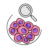
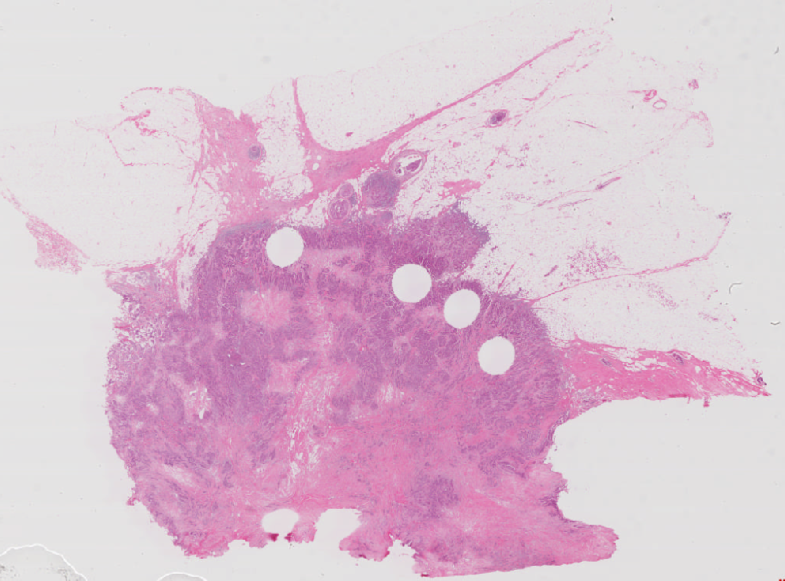
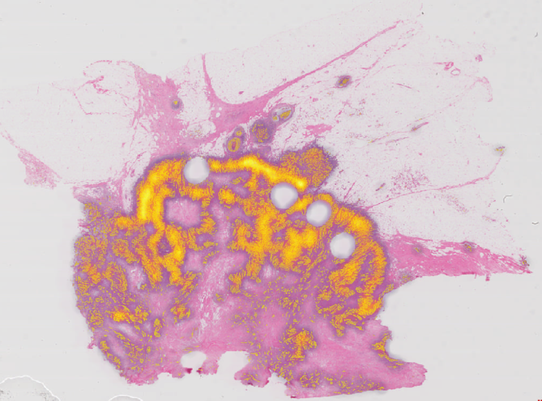
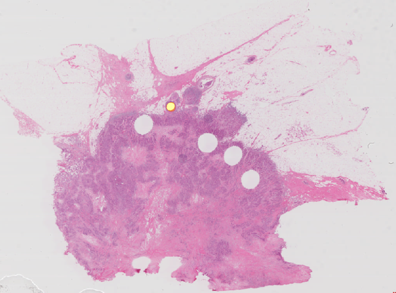
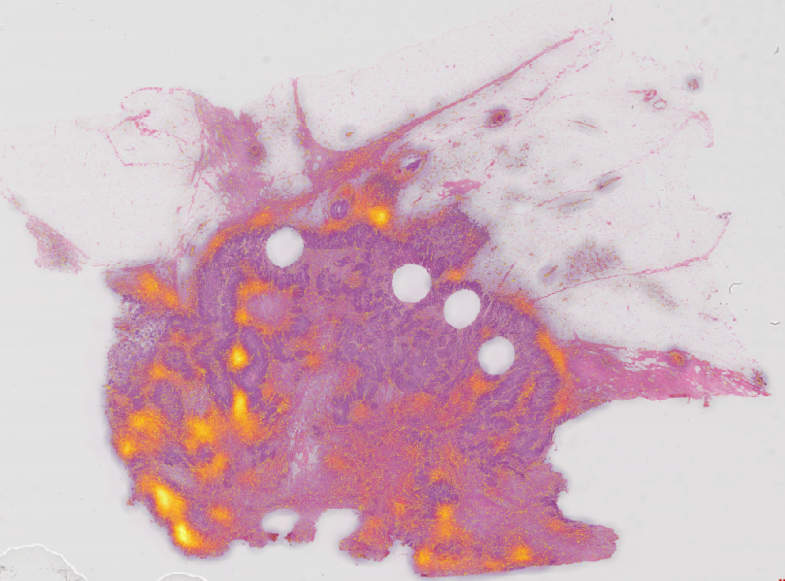

#  WSInsight: Cloud-Native Single-Cell Pathology Inference on Whole Slide Images

WSInsight is a fork of WSInfer that delivers end-to-end pathology inference for giga-pixel whole slide images. It scales from laptops to cloud clusters, orchestrates patch extraction/classification, cell detection/classification, model inference, and downstream analytics, and produces artifacts that can be explored in QuPath, GeoJSON-aware viewers, OMERO+, or bespoke notebooks.

> [!IMPORTANT]
> WSInsight is a research tool. It is not cleared for clinical workflows or patient-facing decisions.


## Highlights

- GPU-accelerated inference for registered models from the WSInfer Model Zoo or custom TorchScript weights
- Automated tissue segmentation, patch extraction, and batched inference with resumable runs
- First-class support for QuPath projects, GeoJSON/OME-CSV exports, and remote slides (S3, GDC manifests)
- Transparent URI handling lets you read WSIs from local disks, S3 buckets, or GDC manifests and write inference outputs back to either local paths or S3 using the same CLI options
- Built for reproducibility: metadata capture, deterministic configuration, and container-friendly execution

## Visual Overview

Original H&E                                               | Heatmap of Tumor Probability
:---------------------------------------------------------:|:-----------------------------------------------------------:
               | 

Heatmap of Dead Cell Probability                           | Heatmap of Connective Cell Probability
:---------------------------------------------------------:|:-----------------------------------------------------------:
     | 

## Documentation

- [Latest user and API guides](https://wsinsight.readthedocs.io)
- [Change history and issue reporting](https://github.com/huangch/wsinsight)

## Quick Start

### WSInfer-compatible workflow

1. Prepare a directory of whole slide images, for example the sample data under `tests/reference`.
2. Choose a registered model name from `wsinfer-zoo ls` or provide a custom configuration.
3. Run inference (one-shot workflow that performs patch extraction + inference):

   ```bash
   wsinsight run \
     --wsi-dir slides/ \
     --results-dir results/ \
     --model breast-tumor-resnet34.tcga-brca \
     --batch-size 32 \
     --num-workers 4
   ```

4. Inspect outputs in `results/model-outputs-*`, open the GeoJSON artifacts in QuPath or your preferred viewer, and review `run_metadata_*.json` for the captured environment details.

Prefer an explicit two-step flow? Run `wsinsight patch` to generate cached patches/HDF5 metadata (idempotent and resumable), then invoke `wsinsight infer` against the same `--results-dir` to produce CSV/GeoJSON/OME-CSV outputs. Both commands expose the identical URI, segmentation, and QuPath options as `wsinsight run`.

### WSInsight-native workflow (CellViT models)

WSInsight adds cell-centric Vision Transformer and HoverNet variants that are not part of upstream WSInfer. To run them:

1. Stage your WSIs as before and ensure the conda environment includes the CellViT dependencies (installed automatically via the instructions above).
2. Pick one of the WSInsight-native model identifiers (see list below) from the registry.
3. Launch inference, for example with `CellViT-SAM-H-x40`:

   ```bash
   wsinsight run \
     --wsi-dir slides/ \
     --results-dir results-cellvit/ \
     --model CellViT-SAM-H-x40 \
     --batch-size 16 \
     --num-workers 8
   ```

4. Review the outputs in `results-cellvit/model-outputs-*` and downstream GeoJSON artifacts just like the compatible workflow.

Available WSInsight model names:

- `CellViT-256-x20`
- `CellViT-256-x40`
- `CellViT-256-x40-AMP`
- `CellViT-SAM-H-x20`
- `CellViT-SAM-H-x40`
- `CellViT-SAM-H-x40-AMP`
- `CellViT-Virchow-x40-AMP`
- `hovernet_fast_pannuke`

> [!TIP]
> Use `CUDA_VISIBLE_DEVICES=… wsinsight run …` to pin execution to specific GPUs. The command prints an environment summary before inference begins.

## Installation

WSInsight supports both a fully reproducible conda workflow and lighter manual installs if you already manage your own environment.

### Option A: Reproducible conda setup (recommended)

Run the following commands from the repository root to recreate the tested environment. Adjust the environment name if you need to keep multiple copies side-by-side. The steps below are also captured in [`conda-setup.sh`](conda-setup.sh) for convenience.

```bash
# reset any previous environment
source /opt/anaconda3/etc/profile.d/conda.sh   # adapt if conda lives elsewhere
conda deactivate || true
conda env remove -n wsinsight -y || true

# create a clean env with Python 3.11 + GDAL 3.11.3
conda create -n wsinsight python=3.11 gdal=3.11.3 "setuptools<67" -c conda-forge -y
conda activate wsinsight
python -m pip install --upgrade pip

# pin numpy < 2 across every install step via constraints.txt
python -m pip install -c constraints.txt "numpy<2"

# install heavy ML stacks first so CUDA dependencies settle early
python -m pip install -c constraints.txt \
  torch torchvision torch-geometric tensorflow keras stardist nvidia-ml-py

# HistomicsTK wheels are hosted externally; keep numpy pinned for ABI safety
python -m pip install \
  --trusted-host github.com \
  --trusted-host raw.githubusercontent.com \
  --trusted-host girder.github.io \
  --find-links https://girder.github.io/large_image_wheels \
  -c constraints.txt "numpy<2" pyvips histomicstk

# pre-install remaining heavy deps to reduce pip resolver backtracking
python -m pip install -c constraints.txt "numpy<2" \
  scikit-learn shapely geopandas pyproj rasterio pyogrio \
  openslide-python wsidicom paquo "wsinfer-zoo>=0.6.2" \
  igraph leidenalg s3fs boto3 platformdirs timm \
  tiffslide imagecodecs opencv-python-headless orjson click

# install WSInsight itself in editable mode (--no-build-isolation speeds up resolve)
python -m pip install -c constraints.txt --no-build-isolation -e .

# safety check: ensure numpy stayed below 2.0 (stardist requires it)
python -c "import numpy; v=numpy.__version__; assert int(v.split('.')[0]) < 2, f'numpy {v} >= 2.0; re-run: pip install -c constraints.txt \"numpy<2\"'"
```

Optionally, run a smoke test to ensure the CLI starts with representative environment variables:

```bash
S3_STORAGE_OPTIONS='{"profile":"saml"}' \
WSINFER_ZOO_REGISTRY_PATH='/workspace/wsinsight/wsinsight/zoo/wsinfer-zoo-registry.json' \
WSINSIGHT_REMOTE_CACHE_DIR='/tmp' \
KERAS_HOME='/workspace/wsinsight/wsinsight/keras' \
wsinsight --help
```

> [!TIP]
> Every `python -m pip install …` line honors `constraints.txt`, keeping the dependency graph deterministic even as upstream wheels evolve.

### Option B: Manual installation

1. **Install deep learning backends**

- Follow the [official PyTorch installation guide](https://pytorch.org/get-started/locally/) for your OS / CUDA stack.
- (Optional) Bring in TensorFlow/Keras if you plan to convert models or run StarDist.
- Verify CUDA visibility with `python -c 'import torch; print(torch.cuda.is_available())'` and confirm your driver matches the [CUDA compatibility matrix](https://docs.nvidia.com/deploy/cuda-compatibility/).

1. **Install WSInsight**

- Stable PyPI: `python -m pip install wsinsight`
- Latest main: `python -m pip install git+https://github.com/huangch/wsinsight.git`
- Conda-Forge: `conda install -c conda-forge wsinsight` (use `mamba install` for faster solving)

1. **Install from source (development)**

```bash
git clone https://github.com/huangch/wsinsight.git
cd wsinsight
python -m pip install --editable .
pre-commit install
```

The editable install enables rapid iteration on CLI commands, model definitions, and docs. `pre-commit` keeps formatting/lint guards active during `git commit`.

## CLI Overview

Command                    | Purpose
-------------------------- | -------
`wsinsight run`            | Segment tissue, extract patches, execute model inference, and optionally run H-plot/ncomp/CME analytics and export (one-shot orchestration of `patch` → `infer` → `hplot` → `ncomp` → `cme` → `export`). Pass `--hplot` / `--ncomp` / `--cme` to enable spatial analytics and `--export-geojson` / `--export-omecsv` to write GeoJSON / OME-CSV files at the end of the run.
`wsinsight patch`          | Perform tissue segmentation, cache/crop patches to HDF5, and prepare metadata for later inference runs; safe to rerun to resume interrupted jobs.
`wsinsight infer`          | Load cached patches, run the selected model, and produce per-cell CSV outputs. Enrich object CSVs with region-level probabilities via `--region-inference-dir` and `--overwrite`. Use the standalone `hplot`/`ncomp`/`export` commands (or `run`) for downstream analytics. Does **not** run H-plot, ncomp, or export — use `run` for one-shot orchestration.
`wsinsight reg`            | Post-hoc object-to-region registration: enrich existing object-level CSV outputs with `region_prob_*` columns derived from a separate region-level inference run (`-r`). Equivalent to running `infer` with `--region-inference-dir`, but works on already-completed runs without re-running inference. Use `--overwrite` to replace existing `region_*` columns.
`wsinsight hplot`          | Standalone H-plot analysis on existing inference outputs. Requires cell-type-aware model outputs and both `--hplot-base-types` and `--hplot-target-types`. Computes layer-wise cell-type proportions from tumour boundary outward.
`wsinsight hplot-finalize` | Aggregate per-slide H-plot intermediates into a single `hplot-outputs.csv` and `hmetrics-outputs.csv`. Use after running parallel `hplot` jobs that share the same `--results-dir`.
`wsinsight ncomp`          | Neighborhood composition analysis on existing cell-detection outputs. For each target cell, builds a Delaunay graph, collects k-hop neighbors, and records the cell-type composition of the local neighborhood. Outputs per-cell CSVs under `ncomp-outputs-csv/`.
`wsinsight cme`            | Cellular microenvironment (CME) analysis across a cohort of slides. Builds per-slide Delaunay cell graphs, trains a global Deep Graph Infomax (DGI) encoder, clusters the resulting embeddings, and writes per-cell CME labels plus annotation-level region merges under `cme-outputs-csv/`.
`wsinsight export`         | Merge all available per-cell analytics (inference, H-plot, ncomp, CME) into `export-csv/` and write GeoJSON and/or OME-CSV files. Can be run any time after inference — and optionally after `hplot`/`ncomp`/`cme` — without repeating the full pipeline.

Pick `run` when you want a one-liner for single slides or small batches; switch to the explicit `patch` → `infer` → `hplot` / `ncomp` / `cme` → `export` flow to resume large jobs, share patch caches across model variants, or parallelize stages on separate machines. `run` is the only command that orchestrates all stages — `infer` focuses solely on model inference. Run the standalone `wsinsight hplot`, `wsinsight ncomp`, or `wsinsight cme` commands to (re-)run analytics on existing inference outputs without repeating inference. Use `wsinsight hplot-finalize` to assemble the cohort-level summary after running parallel `hplot` jobs. Note: CME is a cross-slide analysis (global DGI training + global clustering) and cannot be parallelized across GPU shards — run it after merging all per-shard inference outputs. All commands share global options such as `--log-level`. Use `wsinsight <command> --help` for the full option list, including QuPath integration flags and segmentation controls.

## Results Layout

```text
<results-dir>/
├── masks/                          Tissue segmentation masks (produced by patch / run)
├── patches/                        HDF5 patch files (produced by patch / run)
├── model-outputs-csv/
│   └── <slide>.csv                 Per-patch/cell inference results
├── model-outputs-geojson/
│   └── <slide>.geojson             GeoJSON from reg --geojson (region-registered)
├── model-outputs-omecsv/
│   └── <slide>.ome.csv.gz          OME-CSV from reg --omecsv (region-registered)
├── hplot-outputs-csv/
│   ├── hplots/<slide>.csv          Per-layer H-plot curve (one row per layer)
│   ├── cells/<slide>.csv           Per-cell data with spatial annotations
│   └── hmetrics/<slide>.json       Per-slide H-plot metrics (intermediate)
├── hplot-outputs.csv               Aggregated H-plot curve (all slides)
├── hmetrics-outputs.csv            Aggregated H-plot metrics (all slides)
├── ncomp-outputs-csv/
│   └── <slide>.csv                 Per-cell neighborhood composition
├── cme-outputs-csv/
│   ├── cells/<slide>.csv           Per-cell CME labels + features
│   └── cmes/<slide>.csv            Annotation-level merged CME regions
├── cme-outputs-geojson/
│   ├── cells/<slide>.geojson        GeoJSON cell detections with CME labels
│   └── cmes/<slide>.geojson         GeoJSON CME region annotations
├── graphs/
│   └── <slide>.h5                  Cached Delaunay triangulation (shared by hplot/ncomp/cme)
├── export-csv/
│   └── <slide>.csv                 Merged per-cell CSV (inference + hplot + ncomp + cme)
├── export-geojson/
│   └── <slide>.geojson             GeoJSON export (wsinsight export --geojson)
├── export-omecsv/
│   └── <slide>.ome.csv.gz          OME-CSV export (wsinsight export --omecsv)
└── run_metadata_*.json             Configuration and runtime info
```

## Output File Formats

### `patches/<slide>.h5`

Cached patch coordinates (and optionally images) produced by `patch` or `run`. One HDF5 file per slide.

Dataset / Attribute                         | Shape / Type            | Description
------------------------------------------- | ----------------------- | -----------------------------------------------------------
`/coords`                                   | (N, 2) int32            | Top-left patch coordinates (x, y) at level 0
`/coords` → `patch_size` (attr)             | int32                   | Side length of each patch in pixels
`/coords` → `patch_level` (attr)            | int32                   | WSI magnification level (always 0)
`/coords` → `patch_spacing_um_px` (attr)    | float64                 | Microns-per-pixel used for coordinate calculation
`/coords` → `tile_dim` (attr, optional)     | int32[2]                | Tiling dimensions `[width, height]` for end-to-end models
`/images` (optional)                        | (N, H, W, 3) uint8      | RGB patch images (when `--save-images` is used)
`/polygons/coords` (optional)               | (K, 2) float32          | Tissue polygon vertices (ragged array)
`/polygons/offsets` (optional)              | (M+1,) int64            | Ragged array offsets: polygon *i* = `coords[offsets[i]:offsets[i+1]]`
`/slide` → `slide_path` (attr, optional)    | utf-8 string            | Original WSI file path
`/slide` → `slide_mpp` (attr, optional)     | float64                 | Microns-per-pixel of the WSI
`/slide` → `slide_width` (attr, optional)   | float64                 | WSI width in pixels
`/slide` → `slide_height` (attr, optional)  | float64                 | WSI height in pixels

### `model-outputs-csv/<slide>.csv`

Produced by `infer`, `run`, and `reg`.

Column                                                        | Notes
------------------------------------------------------------- | --------------------------------------------------------------------
`minx`, `miny`                                                | Top-left corner of the patch/detection bounding box (pixels)
`width`, `height`                                             | Bounding box size (pixels)
`prob_<class>`                                                | Model probability for each class (e.g. `prob_tumor`, `prob_lymphocyte`)
`qupath_detection_parent`                                     | Parent annotation name — only with `--qupath-detection-dir`
`region_minx`, `region_miny`, `region_width`, `region_height` | Matched region bounding box — only with `--region-inference-dir`
`region_prob_<class>`                                         | Region-level class probabilities — only with `--region-inference-dir`

### `hplot-outputs-csv/hplots/<slide>.csv`

Per-layer H-plot curve produced by `hplot` or `run --hplot`.

Column              | Description
------------------- | -----------------------------------------------------------------------------------------
`layer`             | Integer layer index; 0 = base-region boundary, negative = inside, positive = outside
`target_type_prop`  | Proportion of target cells at this layer
`target_type_count` | Count of target cells
`base_type_prop`    | Proportion of base cells
`base_type_count`   | Count of base cells
`all_type_count`    | Total cell count
`distance`          | Cumulative µm distance from the border

### `hplot-outputs-csv/cells/<slide>.csv`

Per-cell file: the original `model-outputs-csv/<slide>.csv` extended with spatial columns.

Column                             | Description
---------------------------------- | ---------------------------------------------------------------------------------------------------------------
`minx`, `miny`, `width`, `height`  | Inherited from inference output
`prob_<class>`                     | Inherited from inference output
`center_x`, `center_y`             | Cell centre in pixels
`is_base_type`                     | `True` if the cell's predicted class is a base type
`is_target_type`                   | `True` if the cell's predicted class is a target type
`signed_distance_to_border`        | Hop distance to the base-region boundary; negative = inside, 0 = border, positive = outside, NaN = unreachable

### `hplot-outputs.csv`

Cohort-level H-plot curve aggregated across all slides. Produced by `hplot`, `run --hplot`, or `hplot-finalize`.

Columns: `id`, `layer`, `target_prop`, `target_count`, `base_prop`, `base_count`, `all_count`, `distance`

### `hmetrics-outputs.csv`

Per-slide spatial interaction metrics. One row per slide.

- `id`, `valid`
- `convergence_distance (intra)`, `abundance_score (intra)`, `penetration_score (intra)`
- `layerwise_enrichment_index (intra)`, `global_enrichment_index (intra)`, `weighted_global_enrichment_index (intra)`
- `convergence_distance (peri)`, `abundance_score (peri)`, `proximity_score (peri)`
- `layerwise_enrichment_index (peri)`, `global_enrichment_index (peri)`, `weighted_global_enrichment_index (peri)`
- `exclusion_index`, `desert_index`, `inflammation_index`
- `layerwise_enrichment_index`, `global_enrichment_index`, `weighted_global_enrichment_index`

### `ncomp-outputs-csv/<slide>.csv`

Per-cell neighborhood composition produced by `ncomp` or `run --ncomp`.

Column                         | Description
------------------------------ | ---------------------------------------------------------------
`center_x`, `center_y`         | Cell centre in pixels
`cell_type`                    | Predicted cell type (argmax of `prob_*` columns)
`neighborhood_size`            | Number of k-hop graph neighbors (excluding self)
`neighborhood_<class>_count`   | Count of neighbors of each class; one column per model class
`neighborhood_<class>_prop`    | Proportion of neighbors of each class; one column per model class

### `cme-outputs-csv/cells/<slide>.csv`

Per-cell CME labels and features produced by `cme` or `run --cme`.

Column                                  | Description
--------------------------------------- | ---------------------------------------------------------------
All columns from `model-outputs-csv`    | Inherited inference + region columns
`cme_cluster`                           | Integer cluster label assigned by KMeans (or Leiden-derived k)
`feature_normalized_*`                  | Normalized DGI embedding features (one column per dimension)
`feature_raw_*`                         | Raw DGI embedding features (one column per dimension)

### `cme-outputs-csv/cmes/<slide>.csv`

Annotation-level merged CME regions produced by `cme` or `run --cme`. Adjacent cells sharing the same `cme_cluster` are dissolved into contiguous polygonal regions.

### `graphs/<slide>.h5`

Cached Delaunay triangulation shared by `hplot`, `ncomp`, and `cme`. Created on the first run and reused on subsequent runs to skip the expensive `scipy.spatial.Delaunay` computation. The cache stores **unpruned** edges; each command applies its own distance threshold at load time.

The file is automatically invalidated and rebuilt when the underlying `model-outputs-csv/<slide>.csv` changes (detected via cell count and a SHA-256 hash of cell centres).

HDF5 layout:

Dataset / Attribute            | Shape / Type | Description
------------------------------ | ------------ | ---------------------------------------------------------------
`num_cells` (attr)             | int64        | Row count — fast staleness check
`mpp` (attr)                   | float64      | Microns-per-pixel used for cell centre computation
`centers_hash` (attr)          | bytes        | SHA-256 of `cell_centers` bytes — bulletproof staleness check
`cell_centers`                 | (N, 2) int32 | Cell centres (`center_x`, `center_y`), row-aligned with the CSV
`simplices`                    | (M, 3) int32 | Raw Delaunay triangles (3 vertex indices each)
`edges_source`                 | (E,) int32   | Unique undirected edges — source vertex
`edges_target`                 | (E,) int32   | Unique undirected edges — target vertex
`edges_length`                 | (E,) float64 | Euclidean edge length in pixels

### `export-csv/<slide>.csv`

Merged per-cell CSV produced by `build_export_csvs()` (called programmatically via `wsinsight.export_helpers`). Left-joins `model-outputs-csv`, `hplot-outputs-csv/cells`, `ncomp-outputs-csv`, and `cme-outputs-csv/cells` on shared geometry keys.

Column                                                     | Description
---------------------------------------------------------- | -------------------------------------------
All columns from `model-outputs-csv/<slide>.csv`           | Inherited inference + region columns
`center_x`, `center_y`                                     | Cell centre (added if absent)
`is_base_type`, `is_target_type`                           | From H-plot cells output (when available)
`signed_distance_to_border`                                | From H-plot cells output (when available)
`cell_type`, `neighborhood_size`                           | From ncomp output (when available)
`neighborhood_<class>_count`, `neighborhood_<class>_prop`  | From ncomp output (when available)
`cme_*`                                                    | From CME cell output (when available)
`feature_normalized_*`, `feature_raw_*`                    | From CME cell output (when available)

## Key Parameters

### H-Plot (`--hplot-*` options in `run` and `wsinsight hplot`)

Option                                    | Default    | Description
----------------------------------------- | ---------- | -----------------------------------------------------------------------
`--hplot-base-types`                      | required   | Comma-separated base cell types that define the tumour cluster (e.g. `tumor`)
`--hplot-target-types`                    | required   | Comma-separated target cell types to track across layers (e.g. `lymphocyte`)
`--hplot-max-neighbor-distance`           | `25.0`     | Maximum Delaunay edge length in µm
`--hplot-k`                               | `2`        | k-hop neighborhood radius for region detection
`--hplot-n`                               | `8`        | Minimum neighborhood size for base-region membership
`--hplot-r`                               | `0.5`      | Minimum base-type fraction for base-region membership
`--hplot-range-min`                       | `None`     | Innermost layer index (≤ 0) to include in metrics
`--hplot-range-max`                       | `None`     | Outermost layer index (≥ 1) to include in metrics
`--hplot-samples-with-valid-range-only`   | off        | Exclude slides that do not fully cover `[range-min, range-max]`
`--overwrite`                             | off        | Recompute existing per-slide outputs

### Neighborhood Composition (`--ncomp-*` options in `run` and `wsinsight ncomp`)

Option                           | Default    | Description
-------------------------------- | ---------- | --------------------------------------------------------
`--ncomp-max-neighbor-distance`  | `25.0`     | Maximum Delaunay edge length in µm
`--ncomp-k`                      | `2`        | k-hop neighborhood radius
`--overwrite`                    | off        | Recompute existing per-slide outputs

### Cellular Microenvironment (`--cme-*` options in `run` and `wsinsight cme`)

Option              | Default    | Description
------------------- | ---------- | --------------------------------------------------------
`--cme-hoptimus`    | off        | Enable H-Optimus tissue morphology features (requires GPU + timm)
`--cme-clusters`    | auto       | Number of KMeans clusters; when omitted, determined via Leiden community detection
`--overwrite`       | off        | Delete cached checkpoints and recompute from scratch

### Model Selection

Option                  | Applies to              | Description
----------------------- | ----------------------- | -----------------------------------------------------------------------------------------------------------------------------------------------------------
`-m / --model`          | `run`, `patch`, `infer` | Name of a registered model from the WSInsight / WSInfer Model Zoo. Mutually exclusive with `--config`, `--model-path`, and `--zoo-model-dir`.
`-c / --config`         | `run`, `patch`, `infer` | Path to a custom JSON model configuration file (see `wsinsight/schemas/model-config.schema.json`). Must be paired with `--model-path`. Mutually exclusive with `--model` and `--zoo-model-dir`.
`-p / --model-path`     | `run`, `patch`, `infer` | Path to the custom TorchScript weights. Required when `--config` is used. Mutually exclusive with `--model` and `--zoo-model-dir`.
`-z / --zoo-model-dir`  | `run`, `patch`, `infer` | Path to a folder containing `config.json` and `torchscript_model.pt`. Shorthand for `--config` + `--model-path`. Mutually exclusive with `--model`, `--config`, and `--model-path`.

### Inference Performance

Option                | Default | Applies to       | Description
--------------------- | ------- | ---------------- | -------------------------------------------------------------------------------------------------
`-b / --batch-size`   | `32`    | `run`, `infer`   | Batch size for model inference. Increase for multi-GPU setups.
`-n / --num-workers`  | auto    | `run`, `infer`   | Dataloader workers feeding patches to PyTorch. Default heuristic: `min(2 × GPU count, CPU count)`.
`--export-workers`    | auto    | `infer`          | Worker processes for GeoJSON/OME-CSV export. Default reserves headroom for inference.
`--stitch-workers`    | auto    | `infer`          | Thread pool size for TileFuse object-based detection stitching. Default: `min(8, CPU // 2)`.

## Example Workflows

### Run inference + H-plot + ncomp + export in a single command

```bash
wsinsight run \
  --wsi-dir slides/ \
  --results-dir results/ \
  --model pancancer-lymphocytes-inceptionv4.tcga \
  --batch-size 32 \
  --hplot \
  --hplot-base-types tumor \
  --hplot-target-types lymphocyte \
  --hplot-range-min -5 \
  --hplot-range-max 5 \
  --ncomp \
  --cme \
  --export-geojson \
  --export-omecsv
```

### Run CME analysis on existing inference outputs

```bash
wsinsight cme \
  --wsi-dir slides/ \
  --results-dir results/
```

With H-Optimus morphology features and a fixed cluster count:

```bash
wsinsight cme \
  --wsi-dir slides/ \
  --results-dir results/ \
  --cme-hoptimus \
  --cme-clusters 10
```

### Run H-plot on existing inference outputs

```bash
wsinsight hplot \
  --wsi-dir slides/ \
  --results-dir results/ \
  --hplot-base-types tumor \
  --hplot-target-types lymphocyte \
  --hplot-range-min -5 \
  --hplot-range-max 5
```

### Aggregate H-plot results after parallel runs

```bash
wsinsight hplot-finalize --results-dir results/
```

### Running on a multi-GPU cluster with tmux

For large cohorts on a multi-GPU node, split your slide list into per-GPU shards and run
them in parallel inside a tmux session. Each pane pins one GPU via
`CUDA_VISIBLE_DEVICES` and processes its own shard of slides.

**1. Split slides into shards** (one file per GPU):

```bash
# Example: 8 GPUs → 8 shard files
split -n l/8 --numeric-suffixes=0 --additional-suffix=.txt \
  slides_all.txt datasets/slides_part_
```

**2. Launch a tmux session with one pane per GPU:**

```bash
#!/bin/bash
tmux new-session -d -s wsinsight

# Create a 4×2 grid (4 rows, 2 columns = 8 panes)
tmux split-window -v -t wsinsight:0.0
tmux split-window -v -t wsinsight:0.1
tmux split-window -v -t wsinsight:0.2
tmux select-layout -t wsinsight:0 even-vertical
tmux split-window -h -t wsinsight:0.0
tmux split-window -h -t wsinsight:0.4
tmux split-window -h -t wsinsight:0.6

# Layout:
# [pane 0 | pane 1]   GPU 0 / GPU 4
# [pane 2 | pane 3]   GPU 1 / GPU 5
# [pane 4 | pane 5]   GPU 2 / GPU 6
# [pane 6 | pane 7]   GPU 3 / GPU 7

tmux send-keys -t wsinsight:0.0 "CUDA_VISIBLE_DEVICES=0 wsinsight run -b 20 -i datasets/slides_part_00.txt -z /path/to/zoo-model -o results/" Enter
tmux send-keys -t wsinsight:0.1 "CUDA_VISIBLE_DEVICES=4 wsinsight run -b 20 -i datasets/slides_part_04.txt -z /path/to/zoo-model -o results/" Enter
tmux send-keys -t wsinsight:0.2 "CUDA_VISIBLE_DEVICES=1 wsinsight run -b 20 -i datasets/slides_part_01.txt -z /path/to/zoo-model -o results/" Enter
tmux send-keys -t wsinsight:0.3 "CUDA_VISIBLE_DEVICES=5 wsinsight run -b 20 -i datasets/slides_part_05.txt -z /path/to/zoo-model -o results/" Enter
tmux send-keys -t wsinsight:0.4 "CUDA_VISIBLE_DEVICES=2 wsinsight run -b 20 -i datasets/slides_part_02.txt -z /path/to/zoo-model -o results/" Enter
tmux send-keys -t wsinsight:0.5 "CUDA_VISIBLE_DEVICES=6 wsinsight run -b 20 -i datasets/slides_part_06.txt -z /path/to/zoo-model -o results/" Enter
tmux send-keys -t wsinsight:0.6 "CUDA_VISIBLE_DEVICES=3 wsinsight run -b 20 -i datasets/slides_part_03.txt -z /path/to/zoo-model -o results/" Enter
tmux send-keys -t wsinsight:0.7 "CUDA_VISIBLE_DEVICES=7 wsinsight run -b 20 -i datasets/slides_part_07.txt -z /path/to/zoo-model -o results/" Enter

tmux attach -t wsinsight
```

All panes share the same `--results-dir`, so outputs merge automatically. After all panes
finish, finalize any H-plot or ncomp analytics:

```bash
wsinsight hplot-finalize --results-dir results/
```

See `tmux-multi-gpu.sh` in the repository root for a ready-to-use script.

> [!TIP]
> Adapt the number of panes and GPU assignments to your hardware. For 4 GPUs, use a 2×2
> grid; for 2 GPUs, a simple horizontal split suffices.

### Run neighborhood composition on existing inference outputs

```bash
wsinsight ncomp \
  --wsi-dir slides/ \
  --results-dir results/ \
  --ncomp-k 2
```

### Export merged analytics to GeoJSON / OME-CSV

```bash
wsinsight export \
  --results-dir results/ \
  --geojson \
  --omecsv \
  --export-workers 8
```

### Enrich object CSVs with region probabilities post-hoc

```bash
wsinsight reg \
  --results-dir results-cellvit/ \
  --region-inference-dir results-region/ \
  --overwrite
```

## Models and Configurations

- Models registered in the WSInfer Zoo can be listed with `wsinfer-zoo ls`.
- Bring-your-own models by supplying `--config` (JSON schema documented in `wsinsight/schemas/model-config.schema.json`) together with `--model-path` (TorchScript weights).
- Use `--zoo-model-dir` / `-z` to point at a folder that already contains `config.json` and `torchscript_model.pt`. This is a shorthand for `--config` + `--model-path` and is mutually exclusive with `--model`, `--config`, and `--model-path`.
- QuPath-generated detections and annotations can be used to create pseudo-model runs via the `--qupath-*` options in `wsinsight run`.

## Environment Variables

WSInsight reads the following environment variables at startup. Set them in your shell profile, conda activation script, or container environment so they apply to every command automatically.

Variable | Purpose | Example
--- | --- | ---
`WSINFER_ZOO_REGISTRY_PATH` | Path to a local `wsinfer-zoo-registry.json` file. **Required in air-gapped / restricted-SSL environments.** When set (and the file exists), no network call to HuggingFace is made. | `export WSINFER_ZOO_REGISTRY_PATH=/workspace/wsinsight/devel/zoo/wsinfer-zoo-registry.json`
`S3_STORAGE_OPTIONS` | JSON object passed verbatim to `s3fs` / `fsspec` (e.g. AWS profile, endpoint URL). Required to read/write S3 URIs. | `export S3_STORAGE_OPTIONS='{"profile":"saml"}'`
`WSINSIGHT_REMOTE_CACHE_DIR` | Local directory where remote assets (S3 tiles, GDC downloads) are materialised. Defaults to `~/.cache/wsinsight`. Point it at a fast SSD for large cohorts. | `export WSINSIGHT_REMOTE_CACHE_DIR=/scratch/wsinsight-cache`
`KERAS_HOME` | Override the Keras configuration/weights directory, useful when the default home directory is on a slow or quota-limited filesystem. | `export KERAS_HOME=/workspace/wsinsight/keras`

> [!TIP]
> If the CLI hangs or prints SSL errors on startup, you are almost certainly in an environment where `huggingface.co` is blocked.  Set `WSINFER_ZOO_REGISTRY_PATH` to the local registry file and the issue will disappear.

## Remote and Large-Scale Data

- S3 URIs are supported out of the box; configure credentials via `S3_STORAGE_OPTIONS`.
- `--wsi-dir` can point to local folders, `s3://bucket/prefix` locations, `gdc://path/to/manifest.tsv`, or an `image-list:///path/to/filelist.txt` URI that references a text file listing one slide path per line (blank lines and `#` comments are ignored). When `--wsi-dir` is a plain local text file, it is automatically coerced to `image-list://`. `--results-dir`, GeoJSON, and OME-CSV outputs can be written to local disks or S3 buckets with the same URI syntax.
- Every CLI that accepts `--wsi-dir`, `--results-dir`, `--region-inference-dir`, or QuPath directories uses the same URI resolver as `wsinsight patch`/`infer`. Local paths require `exists=True`, while remote paths honor the `S3_STORAGE_OPTIONS` profile without checking for pre-existence—making it safe to point `--results-dir` at a brand-new bucket/key.
- `WSINSIGHT_REMOTE_CACHE_DIR` determines where remote assets are materialized locally (default: `~/.cache/wsinsight`). Set it to a fast SSD mount when you process tera-scale cohorts.
- GDC manifests can be referenced directly, and the downloaded tiles are cached via the same mechanism.
- For throughput, adjust `--num-workers` to match CPU availability and tune `--batch-size` per GPU memory.

## Development and Testing

- Ensure `ruff`, `black`, and other lint tools remain clean by running `pre-commit run --all-files`.
- Execute the test suite with `pytest` from the project root.
- Documentation lives in `docs/`; build locally with `make -C docs html`.
- Build and push the Docker image with [`docker-build-push.sh`](docker-build-push.sh).
- Pull and run the published image with [`docker-run.sh`](docker-run.sh).

## Support and Feedback

- File bugs or feature requests via [GitHub issues](https://github.com/huangch/wsinsight/issues).
- For general usage questions, start a [GitHub discussion](https://github.com/huangch/wsinsight/discussions) or consult the FAQ in the documentation portal.

## License

WSInsight is released under the terms of the `LICENSE` file included with this repository.

<!--
[](https://github.com/huangch/wsinsight/actions/workflows/ci.yml)
[](https://wsinsight.readthedocs.io/en/latest/?badge=latest)
[](https://pypi.org/project/wsinsight/)
[](https://pypi.org/project/wsinsight/)
[](https://doi.org/10.1038/s41698-024-00499-9)
-->