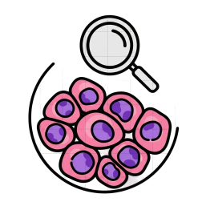
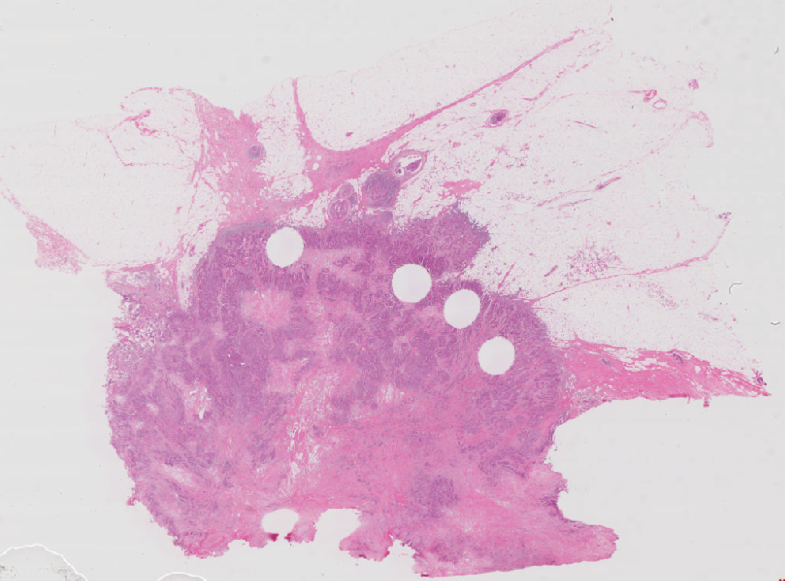
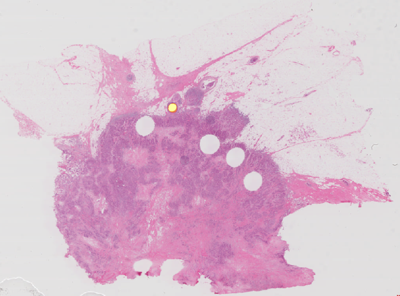
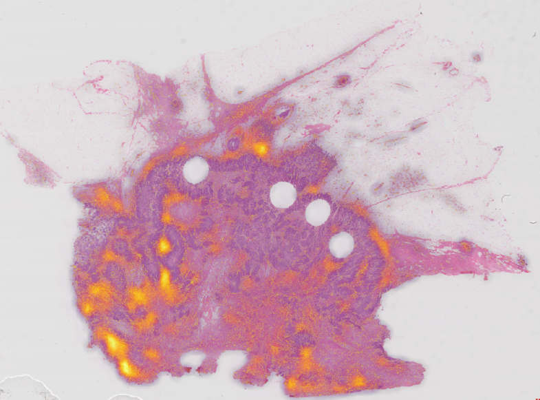
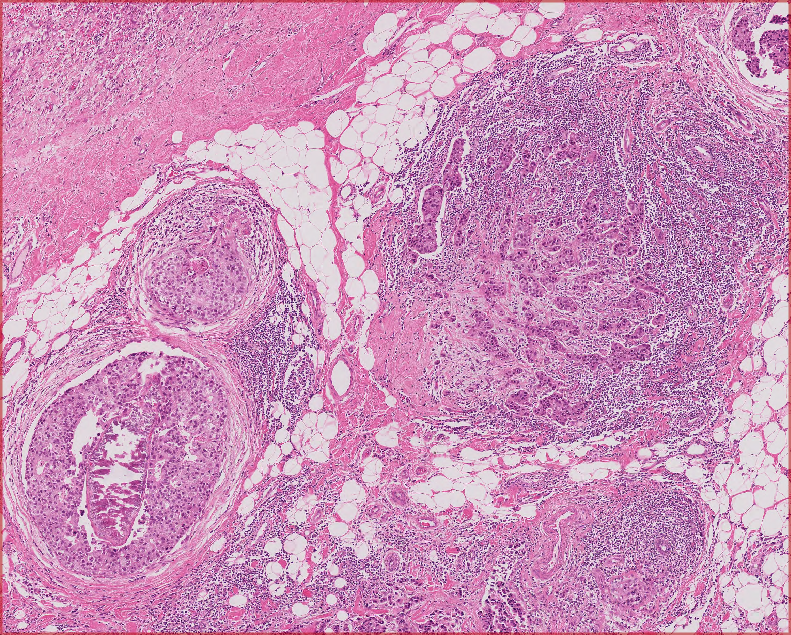
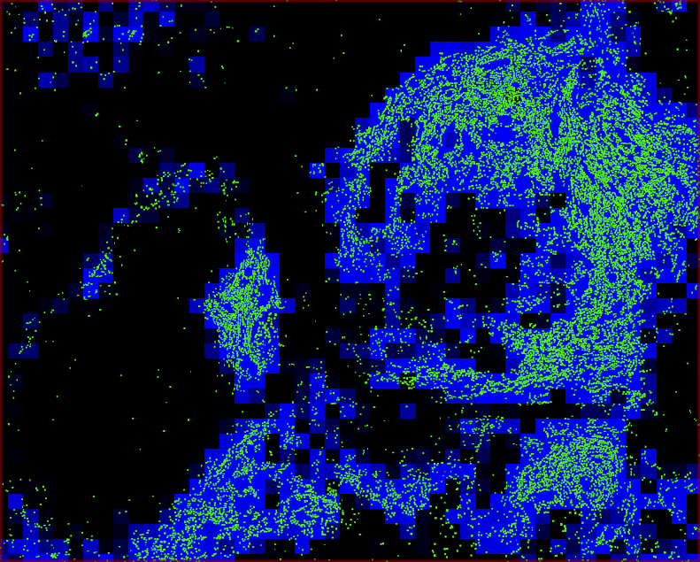
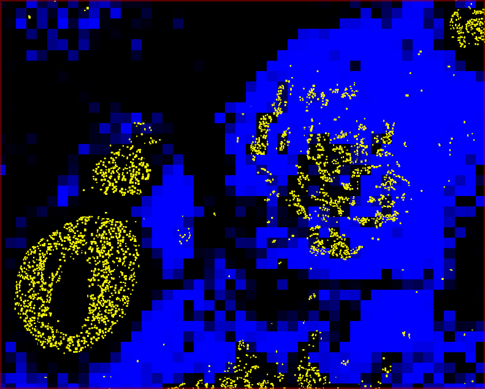
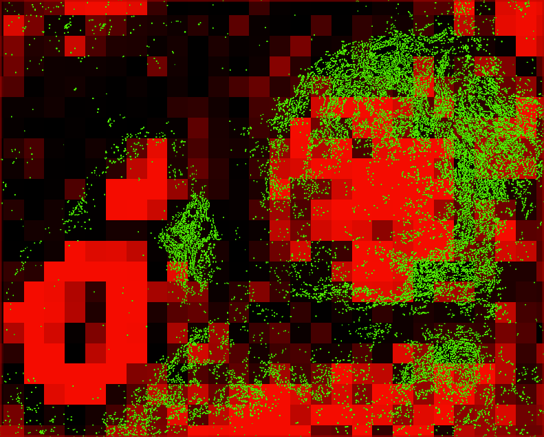
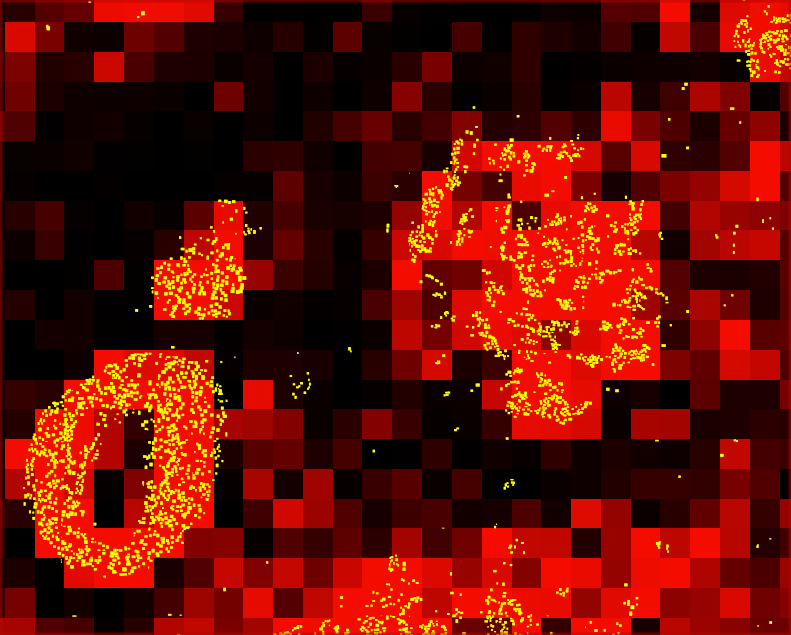

:html_theme.sidebar_secondary.remove:

WSInsight: Cloud-Native Single-Cell Pathology Inference on Whole Slide Images
=============================================================================

.. image:: https://github.com/huangch/wsinsight/actions/workflows/ci.yml/badge.svg
  :alt: GitHub workflow status
  :target: https://github.com/huangch/wsinsight/actions/workflows/ci.yml
.. image:: https://readthedocs.org/projects/wsinsight/badge/?version=latest
  :alt: Documentation build status
  :target: https://wsinsight.readthedocs.io/en/latest/?badge=latest
.. image:: https://img.shields.io/pypi/v/wsinsight.svg
  :alt: PyPI version
  :target: https://pypi.org/project/wsinsight/
.. image:: https://img.shields.io/pypi/pyversions/wsinsight
  :alt: Supported Python versions
  :target: https://pypi.org/project/wsinsight/

|

WSInsight is a fork of `WSInfer <https://github.com/SBU-BMI/wsinfer>`_ that delivers
end-to-end pathology inference for giga-pixel whole slide images. It scales from laptops
to cloud clusters, orchestrates patch extraction/classification, cell detection/
classification, model inference, and downstream analytics, and produces artifacts that
can be explored in QuPath, GeoJSON-aware viewers, OMERO+, or bespoke notebooks.

.. caution::

  WSInsight is a research tool. It is not cleared for clinical workflows or
  patient-facing decisions.

.. image:: _static/diagram.drawio.png
  :alt: WSInsight workflow overview
  :align: center
  :class: workflow-diagram

.. toctree::
  :maxdepth: 2
  :caption: Contents:

  Installing <installing>
  User Guide <user_guide>
  CLI <cli>

Quick start
-----------

Running inference on whole slide images is done with a single command-line
entry point:

::

  wsinsight run \
    --wsi-dir slides/ \
    --results-dir results/ \
    --model breast-tumor-resnet34.tcga-brca \
    --batch-size 32 \
    --num-workers 4

Prefer a staged workflow for large cohorts? Use ``wsinsight patch`` to extract
patches and cache intermediate HDF5 files, then ``wsinsight infer`` to reuse
that cache for one or multiple models. The ``wsinsight run`` command simply
orchestrates those two steps back to back for convenience.

WSInsight accepts both WSInfer-compatible model IDs and WSInsight-native
models. List the registered WSInfer identifiers with ::

  wsinfer-zoo ls

To discover the WSInsight-native CellViT/HoverNet variants, see
:ref:`available-models`.

Highlights
----------

- GPU-accelerated inference for registered models from the WSInfer Model Zoo or
  custom TorchScript weights
- Automated tissue segmentation, patch extraction, and batched inference with
  resumable runs
- First-class support for QuPath projects, GeoJSON/OME-CSV exports, and remote
  slides (S3, GDC manifests)
- Transparent URI handling lets you read WSIs from local disks, S3 buckets, or
  GDC manifests and write inference outputs back to either local paths or S3
  using the same CLI options
- Built for reproducibility: metadata capture, deterministic configuration, and
  container-friendly execution

Visual overview
---------------

.. |img-heatmap-tumor| image:: _static/brca-heatmap-neoplastic.png
  :alt: Heatmap of tumor probability

+------------------------+------------------------------+
| Original H&E           | Heatmap of Tumor Probability |
+------------------------+------------------------------+
| |img-tissue|           | |img-heatmap-tumor|          |
+------------------------+------------------------------+
| Heatmap of Dead Cells  | Heatmap of Connective Cells  |
+------------------------+------------------------------+
| |img-heatmap-dead|     | |img-heatmap-connective|     |
+------------------------+------------------------------+

Integrative patch-level and single-cell inference
-------------------------------------------------

The models used in this experiment include:`CellViT-SAM-H-x40`, `breast-tumor-resnet34.tcga-brca`, and `pancancer-lymphocytes-inceptionv4.tcga`.

+------------------+
| Original H&E ROI |
+------------------+
| |img-roi-hne|    |
+------------------+

+----------------------------------------------+---------------------------------------------------+
| Immune Cells (green) / Lympho Regions (blue) | Neoplastic Cells (yellow) / Lympho Regions (blue) |
+----------------------------------------------+---------------------------------------------------+
| |img-roi-lympho-immune|                      | |img-roi-lympho-neoplastic|                       |
+----------------------------------------------+---------------------------------------------------+
| Immune Cells (green) / Tumor Regions (red)   | Neoplastic Cells (yellow) / Tumor Regions (red)   |
+----------------------------------------------+---------------------------------------------------+
| |img-roi-tumor-immune|                       | |img-roi-tumor-neoplastic|                        |
+----------------------------------------------+---------------------------------------------------+

WSInsight-native workflow (CellViT models)
~~~~~~~~~~~~~~~~~~~~~~~~~~~~~~~~~~~~~~~~~~

WSInsight adds cell-centric Vision Transformer and HoverNet variants that are
not part of upstream WSInfer. To run them:

1. Stage your WSIs as before and ensure the conda environment includes the
  CellViT dependencies (installed automatically via the standard
  installation instructions).
2. Pick one of the WSInsight-native model identifiers (see list in
  :ref:`available-models`) from the registry.
3. Launch inference, for example with ``CellViT-SAM-H-x40``:

  ::

    wsinsight run \
     --wsi-dir slides/ \
     --results-dir results-cellvit/ \
     --model CellViT-SAM-H-x40 \
     --batch-size 16 \
     --num-workers 8

4. Review the outputs in ``results-cellvit/model-outputs-*`` and downstream
  GeoJSON artifacts just like the compatible workflow.

All commands understand local filesystem paths, ``s3://`` URIs, and
``gdc://`` manifests for ``--wsi-dir``. Outputs such as ``--results-dir``,
GeoJSON, and OME-CSV artifacts can be written to local disks or S3 using the
same URI syntax, with caching controlled via ``WSINSIGHT_REMOTE_CACHE_DIR``.

To get started, please :ref:`install WSInsight<installing>` and check out the
:ref:`User Guide`. To get help, report issues or request features, please
`submit a new issue <https://github.com/huangch/wsinsight/issues/new>`_ on our
GitHub repository. If you would like to make your patch classification model
available in WSInsight, please get in touch with us! You can `submit a new
GitHub issue <https://github.com/SBU-BMI/wsinsight/issues/new>`_.

Cell-level model comparison
~~~~~~~~~~~~~~~~~~~~~~~~~~~

.. list-table::
   :header-rows: 1

   * - Method
     - Architecture & Key Features
     - mPQ
     - bPQ
     - Reference
   * - **CellViT**
     - Vision Transformer encoder with U-Net style decoder; trained on
       multi-tissue datasets (e.g., PanNuke); supports multi-class nuclear
       instance segmentation & classification.
     - 0.4980
     - 0.6793
     - `Ref <https://doi.org/10.1016/j.media.2024.103143>`_
   * - **HoVer-Net**
     - ResNet50 CNN backbone with dual-branch decoder; predicts nuclear masks
       + horizontal/vertical (HoVer) distance maps; improves instance
       separation.
     - 0.4629
     - 0.6596
     - `Ref <https://doi.org/10.1016/j.media.2019.101563>`_
   * - **StarDist–ResNet50**
     - ResNet50 backbone + star-convex polygon representation; predicts
       radial distances for nuclei delineation along fixed rays.
     - 0.4796
     - 0.6692
     - `Ref1 <https://link.springer.com/chapter/10.1007/978-3-030-00934-2_30>`_,
       `Ref2 <https://openaccess.thecvf.com/content_cvpr_2016/html/He_Deep_Residual_Learning_CVPR_2016_paper.html>`_

Available models
----------------

WSInsight publishes native CellViT/HoverNet identifiers that appear only in our
registry. A non-exhaustive list is provided below.

* ``CellViT-256-x20``
* ``CellViT-256-x40``
* ``CellViT-256-x40-AMP``
* ``CellViT-SAM-H-x20``
* ``CellViT-SAM-H-x40``
* ``CellViT-SAM-H-x40-AMP``
* ``CellViT-Virchow-x40-AMP``
* ``hovernet_fast_pannuke``

After installing :code:`wsinsight`, use the following command to list the most up-to-date
WSInfer-compatible models: ::

  wsinfer-zoo ls

.. list-table::
   :header-rows: 1

   * - Classification task
     - Output classes
     - Architecture
     - Dataset
     - Resolution (px @ um/px)
     - Reference
   * - Breast adenocarcinoma detection
     - no-tumor, tumor
     - ResNet34
     - TCGA BRCA
     - 350 @ 0.25
     - `Ref <https://doi.org/10.1016%2Fj.ajpath.2020.03.012>`_
   * - Colorectal tissue classification
     - background, normal_colon_mucosa, debris, colorectal_adenocarcinoma_epithelium, adipose, mucus, smooth_muscle, cancer_associated_stroma, lymphocytes
     - ResNet50 (trained by TIAToolbox dev team)
     - NCT-CRC-HE-100K
     - 224 @ 0.5
     - `Ref <https://doi.org/10.1038/s43856-022-00186-5>`_
   * - Lung adenocarcinoma detection
     - lepidic, benign, acinar, micropapillary, mucinous, solid
     - ResNet34
     - TCGA LUAD
     - 350 @ 0.5
     - `Ref <https://github.com/SBU-BMI/quip_lung_cancer_detection>`_
   * - Lymph node metastasis detection in breast cancer
     - nomets, mets
     - ResNet50 (trained via TIAToolbox dev team)
     - PatchCamelyon
     - 96 @ 1.0
     - `Ref <https://doi.org/10.1038/s43856-022-00186-5>`_
   * - Lymphocyte detection
     - til-negative, til-positive
     - InceptionV4 (without batchnorm)
     - 23 TCGA studies
     - 100 @ 0.5
     - `Ref <https://doi.org/10.3389/fonc.2021.806603>`_
   * - Pancreatic adenocarcinoma detection
     - tumor-positive
     - Preactivation ResNet34
     - TCGA PAAD
     - 350 @ 1.5
     - `Ref <https://doi.org/10.1007/978-3-030-32239-7_60>`_
   * - Prostate adenocarcinoma detection
     - grade3, grade4or5, benign
     - ResNet34
     - TCGA PRAD
     - 175 @ 0.5
     - `Ref <https://github.com/SBU-BMI/quip_prad_cancer_detection>`_

.. admonition:: Citation

  If you find our work useful, please cite our work in npj Precision Oncology
  and the original WSInfer paper.

  Huang, C.-H., Awosika, O. E., & Fernandez, D. (2025).
  WSInsight as a cloud-native pipeline for single-cell pathology inference on whole-slide images. 
  bioRxiv. https://doi.org/10.1101/2025.692260

  Kaczmarzyk, J.R., O'Callaghan, A., Inglis, F. et al. Open and reusable deep
  learning for pathology with WSInfer and QuPath. *npj Precis. Onc.* **8**, 9
  (2024). https://doi.org/10.1038/s41698-024-00499-9

Indices and tables
==================

* :ref:`genindex`
* :ref:`modindex`
* :ref:`search`
